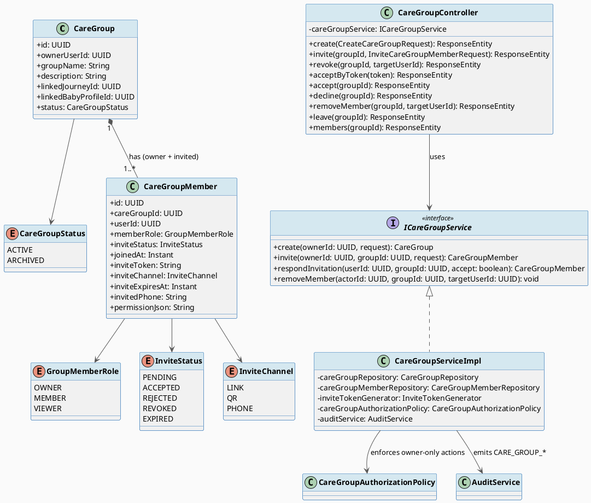
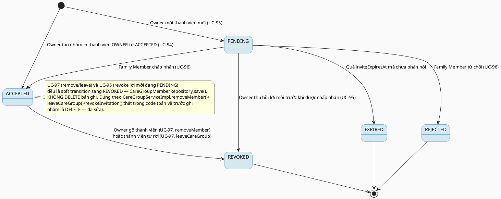

# MF-10 / Spec 01 — Care Group & Invitation Lifecycle

| Field | Value |
| --- | --- |
| Feature | MF-10 — Family Sync & Cooperative Care |
| Use Cases Covered | UC-94 Create Care Group, UC-95 Invite or Revoke Family Member Invitation, UC-96 Accept or Reject Care Group Invitation, UC-97 Manage Care Group Membership |
| Primary Actor(s) | Mother (owner), Family Member (invitee) |
| Platform | Mother Mobile App, Family Mobile App |
| Main Flow Summary | A Mother creates a `CareGroup` (owner by default), invites a family member via link/QR/phone, the recipient accepts or rejects after authenticating, and either the owner removes a member or a member leaves on their own. |
| Grounding (source code) | `family/entity/CareGroup.java`, `CareGroupStatus.java`, `family/entity/CareGroupMember.java`, `GroupMemberRole.java`, `InviteStatus.java`, `InviteChannel.java`, `family/controller/CareGroupController.java` (`/api/v1/care-groups`) |

## 1. Tổng quan luồng chính (Main Flow Overview)

`CareGroup` gắn với một `MotherJourney`/`BabyProfile` cụ thể (`linkedJourneyId`/
`linkedBabyProfileId`), do Mother tạo và tự động là `OWNER` (UC-94). Mời thành viên
(UC-95) tạo một `CareGroupMember` với `inviteStatus=PENDING` và một trong ba kênh
(`LINK`/`QR`/`PHONE`) — link/QR dùng `inviteToken` có hạn (`inviteExpiresAt`), phone dùng
`invitedPhone` trực tiếp. Người được mời xác thực rồi chấp nhận hoặc từ chối (UC-96,
chuyển `inviteStatus` sang `ACCEPTED`/`REJECTED`). Sau khi là thành viên chính thức, owner
có thể gỡ thành viên hoặc chính thành viên tự rời nhóm (UC-97) — cả hai đều là thao tác
trên cùng bản ghi `CareGroupMember`, không tạo entity mới.

## 2. Class Diagram

**Hình 1 — Class Diagram: Care Group & Member Invitation**

## 3. Sequence Diagram — Main Flow

```plantuml
@startuml MF10_01_CareGroup_SequenceDiagram
skinparam sequenceArrowThickness 2
skinparam roundcorner 10
skinparam backgroundColor #FAFAFA

actor "Mother (Owner)" as M
actor "Family Member" as F
participant "CareGroupController" as Controller
participant "CareGroupServiceImpl" as Service
participant "CareGroupRepository" as GroupRepo
participant "CareGroupMemberRepository" as MemberRepo
participant "UserRepository" as UserRepo
participant "InviteTokenGenerator" as TokenGen
participant "CareGroupAuthorizationPolicy" as AuthPolicy
participant "FcmService" as FcmSvc
participant "AuditService" as Audit
database "PostgreSQL" as DB

== UC-94 Create Care Group ==
M -> Controller : 1. POST /api/v1/care-groups\n{groupName, linkedJourneyId, linkedBabyProfileId}
activate Controller
Controller -> Service : 2. createCareGroup(request, callerId)
activate Service
Service -> GroupRepo : 3. save(CareGroup{ownerUserId=callerId, status=ACTIVE})
activate GroupRepo
GroupRepo -> DB : 4. INSERT INTO care_groups ...
activate DB
DB --> GroupRepo : 5. saved
deactivate DB
GroupRepo --> Service : 6. CareGroup
deactivate GroupRepo
Service -> MemberRepo : 7. save(CareGroupMember{userId=callerId, memberRole=OWNER,\ninviteStatus=ACCEPTED, joinedAt=now()})
activate MemberRepo
MemberRepo -> DB : 8. INSERT INTO care_group_members ...
activate DB
DB --> MemberRepo : 9. saved
deactivate DB
MemberRepo --> Service : 10. CareGroupMember
deactivate MemberRepo
Service -> Audit : 11. log(CARE_GROUP_CREATED, callerId,\n"CareGroup", groupId, "created")
activate Audit
Audit --> Service : 12. void
deactivate Audit
Service --> Controller : 13. CreateCareGroupResponse
deactivate Service
Controller --> M : 14. HTTP 201 Created
deactivate Controller

== UC-95 Invite or Revoke Family Member Invitation ==
M -> Controller : 15. POST /api/v1/care-groups/{groupId}/invitations\n{channel=PHONE, phone}
activate Controller
Controller -> Service : 16. inviteFamilyMember(groupId, request, callerId)
activate Service
Service -> GroupRepo : 17. findById(groupId)
activate GroupRepo
GroupRepo -> DB : 18. SELECT * FROM care_groups WHERE id=?
activate DB
DB --> GroupRepo : 19. group row (404 FAM-005 nếu không có)
deactivate DB
GroupRepo --> Service : 20. CareGroup
deactivate GroupRepo
Service -> AuthPolicy : 21. isOwner(groupId, callerId)
activate AuthPolicy
AuthPolicy --> Service : 22. boolean (403 FAM-012 nếu không phải owner)
deactivate AuthPolicy
Service -> MemberRepo : 23. countByCareGroupIdAndInviteStatus(groupId, PENDING)\n[giới hạn tối đa 20 lời mời chờ]
activate MemberRepo
MemberRepo -> DB : 24. SELECT COUNT(*) FROM care_group_members\nWHERE care_group_id=? AND invite_status='PENDING'
activate DB
DB --> MemberRepo : 25. count (409 FAM-013 nếu ≥ 20)
deactivate DB
MemberRepo --> Service : 26. count
deactivate MemberRepo
Service -> TokenGen : 27. generate() [token ngẫu nhiên an toàn]
activate TokenGen
TokenGen --> Service : 28. rawToken
deactivate TokenGen
alt 29. channel == PHONE
  Service -> UserRepo : 29. findByPhone(phone)\n[bắt buộc đã có tài khoản CareBridge]
  activate UserRepo
  UserRepo -> DB : 30. SELECT * FROM users WHERE phone=?
  activate DB
  DB --> UserRepo : 31. user row (404 FAM-014 nếu không có)
  deactivate DB
  UserRepo --> Service : 32. User
  deactivate UserRepo
  Service -> MemberRepo : 33. save(CareGroupMember{userId=invitee.id, memberRole=MEMBER,\ninviteStatus=PENDING, inviteChannel=PHONE, inviteToken, inviteExpiresAt=+7 ngày})
  activate MemberRepo
  MemberRepo -> DB : 34. INSERT INTO care_group_members ...
  activate DB
  DB --> MemberRepo : 35. saved
  deactivate DB
  MemberRepo --> Service : 36. CareGroupMember
  deactivate MemberRepo
  Service -> Audit : 37. log(CARE_GROUP_MEMBER_INVITED, callerId,\n"CareGroupMember", memberId, "phone invite created")
  activate Audit
  Audit --> Service : 38. void
  deactivate Audit
else 29. channel == LINK hoặc QR
  Service -> Audit : 29a. log(CARE_GROUP_MEMBER_INVITED, callerId,\n"CareGroupInviteToken", tokenPrefix, channel+" invite issued")
  activate Audit
  Audit --> Service : 29b. void
  deactivate Audit
end
Service -> Service : 39. publishInviteEvent(FamilyMemberInvited)\n[payload chỉ chứa SHA-256 hash của token — KHÔNG log token thô]
Service --> Controller : 40. InviteFamilyMemberResponse{inviteToken,\ncareGroupMemberId = null nếu LINK/QR}
deactivate Service
Controller --> M : 41. HTTP 201 Created {inviteToken}
deactivate Controller

M -> Controller : 42. POST /api/v1/care-groups/{groupId}/invitations/{targetUserId}/revoke
activate Controller
Controller -> Service : 43. revokeInvitation(groupId, targetUserId, callerId)
activate Service
Service -> GroupRepo : 44. findById(groupId)
activate GroupRepo
GroupRepo -> DB : 45. SELECT * FROM care_groups WHERE id=?
activate DB
DB --> GroupRepo : 46. group row
deactivate DB
GroupRepo --> Service : 47. CareGroup
deactivate GroupRepo
Service -> AuthPolicy : 48. requireOwner(groupId, callerId)\n[403 FAM-050 nếu không phải owner;\n400 FAM-053 nếu tự thu hồi chính mình]
activate AuthPolicy
AuthPolicy --> Service : 49. void
deactivate AuthPolicy
Service -> MemberRepo : 50. findByCareGroupIdAndUserId(groupId, targetUserId)
activate MemberRepo
MemberRepo -> DB : 51. SELECT * FROM care_group_members\nWHERE care_group_id=? AND user_id=?
activate DB
DB --> MemberRepo : 52. member row (404 FAM-051 nếu không có)
deactivate DB
MemberRepo --> Service : 53. CareGroupMember\n(409 FAM-052 nếu inviteStatus khác PENDING)
deactivate MemberRepo
Service -> MemberRepo : 54. save(member{inviteStatus=REVOKED})
activate MemberRepo
MemberRepo -> DB : 55. UPDATE care_group_members SET invite_status='REVOKED'
activate DB
DB --> MemberRepo : 56. updated
deactivate DB
MemberRepo --> Service : 57. CareGroupMember
deactivate MemberRepo
Service -> Audit : 58. log(CARE_GROUP_INVITE_REVOKED, callerId,\n"CareGroup", groupId, "invite revoked for user "+targetUserId)
activate Audit
Audit --> Service : 59. void
deactivate Audit
Service --> Controller : 60. RevokeInvitationResponse{inviteStatus=REVOKED}
deactivate Service
Controller --> M : 61. HTTP 200 OK
deactivate Controller

== UC-96 Accept or Reject Care Group Invitation (token-based) ==
F -> Controller : 62. POST /api/v1/care-groups/invitations/{token}/accept
activate Controller
Controller -> Service : 63. acceptInvitationByToken(token, callerId)
activate Service
Service -> MemberRepo : 64. findByInviteToken(token)
activate MemberRepo
MemberRepo -> DB : 65. SELECT * FROM care_group_members WHERE invite_token=?
activate DB
DB --> MemberRepo : 66. member row (404 FAM-040 nếu không có)
deactivate DB
MemberRepo --> Service : 67. CareGroupMember
deactivate MemberRepo
Service -> Service : 68. kiểm tra hết hạn (lazy expiry) — quá inviteExpiresAt\n→ đánh dấu EXPIRED, trả 410 FAM-041
Service -> Service : 69. kiểm tra inviteStatus vẫn PENDING (409 FAM-042 nếu không)
opt 70. inviteChannel == PHONE
  Service -> AuthPolicy : 70a. isPhoneMatchForInvite(member, callerId)\n[SĐT đã xác thực của caller phải khớp invitedPhone]
  activate AuthPolicy
  AuthPolicy --> Service : 70b. boolean (403 FAM-043 nếu không khớp)
  deactivate AuthPolicy
end
Service -> MemberRepo : 71. acceptIfPending(memberId, now)\n[UPDATE có điều kiện — chống double-accept đồng thời]
activate MemberRepo
MemberRepo -> DB : 72. UPDATE care_group_members\nSET invite_status='ACCEPTED', joined_at=?, user_id=?\nWHERE id=? AND invite_status='PENDING'
activate DB
DB --> MemberRepo : 73. rows affected (0 nếu đã accept trước đó → 409 FAM-042)
deactivate DB
MemberRepo --> Service : 74. rows
deactivate MemberRepo
Service -> Audit : 75. log(CARE_GROUP_INVITATION_ACCEPTED, callerId,\n"CareGroupMember", memberId, "accepted via token")
activate Audit
Audit --> Service : 76. void
deactivate Audit
Service -> FcmSvc : 77. sendToTokens(ownerDeviceTokens, "Lời mời đã được chấp nhận", ...)\n[best-effort — lỗi KHÔNG rollback transaction]
activate FcmSvc
FcmSvc --> Service : 78. void
deactivate FcmSvc
Service --> Controller : 79. AcceptInvitationByTokenResponse{inviteStatus=ACCEPTED}
deactivate Service
Controller --> F : 80. HTTP 200 OK
deactivate Controller

== UC-97 Manage Care Group Membership ==
M -> Controller : 81. DELETE /api/v1/care-groups/{groupId}/members/{targetUserId}
activate Controller
Controller -> Service : 82. removeMember(groupId, targetUserId, callerId)
activate Service
Service -> AuthPolicy : 83. requireOwner(groupId, callerId)
activate AuthPolicy
AuthPolicy --> Service : 84. void
deactivate AuthPolicy
Service -> MemberRepo : 85. findByCareGroupIdAndUserId(groupId, targetUserId)\n[404 nếu không có; 409 nếu target là OWNER hoặc chưa ACCEPTED]
activate MemberRepo
MemberRepo -> DB : 86. SELECT * FROM care_group_members\nWHERE care_group_id=? AND user_id=?
activate DB
DB --> MemberRepo : 87. member row
deactivate DB
MemberRepo --> Service : 88. CareGroupMember
deactivate MemberRepo
Service -> MemberRepo : 89. save(member{inviteStatus=REVOKED})\n[soft — KHÔNG xoá bản ghi]
activate MemberRepo
MemberRepo -> DB : 90. UPDATE care_group_members SET invite_status='REVOKED'
activate DB
DB --> MemberRepo : 91. updated
deactivate DB
MemberRepo --> Service : 92. CareGroupMember
deactivate MemberRepo
Service -> Audit : 93. log(CARE_GROUP_MEMBER_REMOVED, callerId,\n"CareGroup", groupId, "member removed: "+targetUserId)
activate Audit
Audit --> Service : 94. void
deactivate Audit
Service --> Controller : 95. RemoveMemberResponse{inviteStatus=REVOKED}
deactivate Service
Controller --> M : 96. HTTP 200 OK
deactivate Controller

F -> Controller : 97. POST /api/v1/care-groups/{groupId}/leave
activate Controller
Controller -> Service : 98. leaveCareGroup(groupId, callerId)
activate Service
Service -> MemberRepo : 99. findByCareGroupIdAndUserId(groupId, callerId)\n[409 nếu OWNER cố rời, hoặc chưa ACCEPTED]
activate MemberRepo
MemberRepo -> DB : 100. SELECT * FROM care_group_members\nWHERE care_group_id=? AND user_id=?
activate DB
DB --> MemberRepo : 101. member row
deactivate DB
MemberRepo --> Service : 102. CareGroupMember
deactivate MemberRepo
Service -> Service : 103. reassignIncompleteTasks(groupId, callerId, ownerUserId)\n[CareTask đang giao cho người rời được chuyển lại cho OWNER]
Service -> MemberRepo : 104. save(member{inviteStatus=REVOKED})
activate MemberRepo
MemberRepo -> DB : 105. UPDATE care_group_members SET invite_status='REVOKED'
activate DB
DB --> MemberRepo : 106. updated
deactivate DB
MemberRepo --> Service : 107. CareGroupMember
deactivate MemberRepo
Service -> Audit : 108. log(CARE_GROUP_MEMBER_LEFT, callerId,\n"CareGroup", groupId, "member left")
activate Audit
Audit --> Service : 109. void
deactivate Audit
Service --> Controller : 110. LeaveCareGroupResponse{reassignedTaskCount}
deactivate Service
Controller --> F : 111. HTTP 200 OK
deactivate Controller

@enduml
```

**Hình 2 — Sequence Diagram: Create Group → Invite/Revoke → Accept (token) → Remove/Leave (Main Flow)**

> **Ghi chú grounding (quan trọng — sửa lại nhận định sai ở bản trước):**
> 1. `removeMember`, `leaveCareGroup` VÀ `revokeInvitation` đều là **soft transition**
>    (`inviteStatus` → `REVOKED`), **không** `DELETE` bản ghi `CareGroupMember` — ngược lại
>    hoàn toàn với ghi chú cũ ở mục 4 ("thực hiện DELETE... không chuyển sang trạng thái").
>    Bản vẽ và state machine đã được sửa lại cho khớp code thật.
> 2. Với kênh `LINK`/`QR`, `inviteFamilyMember` **không tạo bản ghi `CareGroupMember`** tại
>    thời điểm mời (cột `user_id` là `NOT NULL`, chưa có identity để gán) — chỉ trả token.
>    Nhưng `acceptInvitationByToken` lại tra cứu bằng `memberRepository.findByInviteToken(...)`,
>    và comment trong code xác nhận "only PHONE-channel invites have a DB row" — nghĩa là
>    **luồng chấp nhận qua token cho kênh LINK/QR hiện chưa có đường hoàn chỉnh** trong
>    backend (chỉ kênh PHONE có vòng đời mời→chấp nhận đầy đủ). Cần xác nhận với đội phát
>    triển trước khi coi UC-96 qua LINK/QR là "hoàn chỉnh".
> 3. `leaveCareGroup` có tác dụng phụ quan trọng chưa từng vẽ: gọi
>    `taskRepository.reassignIncompleteTasks(...)` để chuyển các `CareTask` chưa hoàn thành
>    của người rời nhóm về lại cho `OWNER` trước khi rời.
> 4. Bước gửi FCM cho owner sau khi accept-by-token gọi
>    `memberRepository.findByCareGroupIdAndUserId(member.getCareGroupId(), member.getCareGroupId())`
>    — truyền `groupId` vào tham số `userId`, nhiều khả năng là lỗi lập trình khiến bước
>    thông báo cho owner không hoạt động đúng như kỳ vọng trong thực tế.

## 4. State Machine — `CareGroupMember.inviteStatus`

**Hình 3 — State Machine: `CareGroupMember.inviteStatus` Lifecycle**

## 5. Business Rules Applied

- BR-RBAC — chỉ `OWNER` mời/thu hồi lời mời và gỡ thành viên khác; thành viên thường chỉ tự rời được chính mình.
- UC-95 — link/QR dùng `inviteToken` có hạn; kênh phone không cần token nhưng vẫn yêu cầu xác thực khi chấp nhận (UC-96).
- UC-96 — chỉ người dùng đã xác thực mới chấp nhận/từ chối được lời mời của chính họ.
- UC-97 — quyền gỡ thành viên và quyền rời nhóm được tách biệt theo vai trò (`CareGroupAuthorizationPolicy`).
