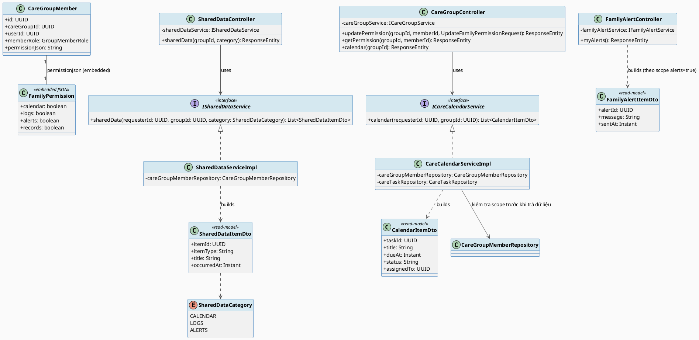
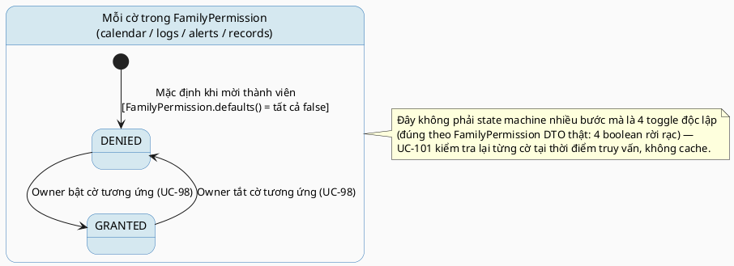

# MF-10 / Spec 02 — Family Permission Scope & Shared Care Visibility

| Field | Value |
| --- | --- |
| Feature | MF-10 — Family Sync & Cooperative Care |
| Use Cases Covered | UC-98 Manage Family Permission Scope, UC-101 View Shared Care Calendar, Data and Alerts |
| Primary Actor(s) | Mother (grants scope), Family Member (consumes within scope) |
| Platform | Mother Mobile App, Family Mobile App |
| Main Flow Summary | A Mother defines which categories of data (calendar, logs, alerts, records) a specific family member may see, stored as a per-membership permission scope; the family member then views only the calendar items, shared data and alerts allowed by their current scope — never more. |
| Grounding (source code) | `family/entity/CareGroupMember.java` (`permissionJson`), `family/dto/FamilyPermission.java`, `family/entity/PermissionFlag.java`, `family/entity/SharedDataCategory.java`, `family/controller/CareGroupController.java` (`/{groupId}/members/{memberId}/permissions`, `/{groupId}/calendar`), `family/controller/SharedDataController.java` (`/{groupId}/shared-data`), `family/controller/FamilyAlertController.java` (`/api/v1/family-alerts`) |

## 1. Tổng quan luồng chính (Main Flow Overview)

Đây là mô hình "consent nội bộ nhóm" của MF-10 — khác với `ConsentGrant` (MF-01, dùng cho
chia sẻ điểm-tới-điểm có hạn) hoặc `DataPermission` (MF-08, dùng cho chia sẻ với
chuyên gia). Ở đây, phạm vi quyền được lưu **trực tiếp trên `CareGroupMember.permissionJson`**
dưới dạng 4 cờ boolean (`calendar`/`logs`/`alerts`/`records` — DTO `FamilyPermission`),
do Owner cập nhật cho từng thành viên (UC-98). Mọi truy vấn dữ liệu chia sẻ của Family
Member (lịch chăm sóc UC-101, dữ liệu chia sẻ, cảnh báo gia đình) đều lọc lại theo đúng
scope hiện tại của `CareGroupMember` gọi request đó — không có bảng "shared calendar"
hay "shared data" vật lý riêng, tất cả là read-model được lọc lại từ dữ liệu gốc
(`CareTask`, `BabyDailyLog`, `FamilyAlertLog`...) theo permission.

## 2. Class Diagram

**Hình 1 — Class Diagram: Family Permission Scope & Shared Read-Models**

## 3. Sequence Diagram — Main Flow

```plantuml
@startuml MF10_02_FamilyPermission_SequenceDiagram
skinparam sequenceArrowThickness 2
skinparam roundcorner 10
skinparam backgroundColor #FAFAFA

actor "Mother (Owner)" as M
actor "Family Member" as F
participant "CareGroupController" as GroupController
participant "CareGroupServiceImpl" as Service
participant "CareGroupRepository" as GroupRepo
participant "CareGroupMemberRepository" as MemberRepo
participant "CareGroupAuthorizationPolicy" as AuthPolicy
participant "FcmService" as FcmSvc
participant "AuditService" as Audit
participant "CareCalendarServiceImpl" as CalService
participant "CareTaskRepository" as TaskRepo
participant "SharedDataController" as SharedController
participant "SharedDataServiceImpl" as SharedService
participant "FamilyAlertController" as AlertController
participant "FamilyAlertServiceImpl" as AlertService
participant "NotificationRecordRepository" as NotifRepo
database "PostgreSQL" as DB

== UC-98 Manage Family Permission Scope ==
M -> GroupController : 1. PATCH /api/v1/care-groups/{groupId}/members/{memberId}/permissions\n{calendar=true, logs=true, alerts=false, records=false}
activate GroupController
GroupController -> Service : 2. updateFamilyPermission(groupId, memberId, request, callerId)
activate Service
Service -> GroupRepo : 3. findById(groupId)
activate GroupRepo
GroupRepo -> DB : 4. SELECT * FROM care_groups WHERE id=?
activate DB
DB --> GroupRepo : 5. group row
deactivate DB
GroupRepo --> Service : 6. CareGroup
deactivate GroupRepo
Service -> AuthPolicy : 7. canManagePermissions(groupId, callerId) [OWNER only]
activate AuthPolicy
AuthPolicy --> Service : 8. boolean (403 FAM-021 if not owner)
deactivate AuthPolicy
Service -> MemberRepo : 9. findByIdAndCareGroupId(memberId, groupId)\n[target must be ACCEPTED]
activate MemberRepo
MemberRepo -> DB : 10. SELECT * FROM care_group_members\nWHERE id=? AND care_group_id=?
activate DB
DB --> MemberRepo : 11. member row (404 FAM-020 if not found/not ACCEPTED)
deactivate DB
MemberRepo --> Service : 12. CareGroupMember{permissionJson}
deactivate MemberRepo
Service -> Service : 13. merge request with current permission\n(null fields in request = keep old value)
Service -> MemberRepo : 14. save(member{permissionJson=updatedJson})
activate MemberRepo
MemberRepo -> DB : 15. UPDATE care_group_members SET permission_json=?
activate DB
DB --> MemberRepo : 16. updated
deactivate DB
MemberRepo --> Service : 17. CareGroupMember
deactivate MemberRepo
Service -> Audit : 18. log(CARE_GROUP_PERMISSION_UPDATED, callerId,\n"CareGroupMember", memberId, "permission updated")
activate Audit
Audit --> Service : 19. void
deactivate Audit
Service -> Service : 20. publishEvent(FamilyPermissionUpdated)
Service -> FcmSvc : 21. sendToTokens(memberDeviceTokens,\n"Access permission changed", ...)\n[best-effort, DO NOT rollback if error]
activate FcmSvc
FcmSvc --> Service : 22. void
deactivate FcmSvc
Service --> GroupController : 23. FamilyPermissionResponse{calendar,logs,alerts,records}
deactivate Service
GroupController --> M : 24. HTTP 200 OK
deactivate GroupController

== UC-101 View Shared Care Calendar, Data and Alerts ==
F -> GroupController : 25. GET /api/v1/care-groups/{groupId}/calendar?rangeStart=&rangeEnd=
activate GroupController
GroupController -> CalService : 26. getCalendar(groupId, callerId, rangeStart, rangeEnd)
activate CalService
CalService -> GroupRepo : 27. findById(groupId)
activate GroupRepo
GroupRepo -> DB : 28. SELECT * FROM care_groups WHERE id=?
activate DB
DB --> GroupRepo : 29. group row
deactivate DB
GroupRepo --> CalService : 30. CareGroup
deactivate GroupRepo
CalService -> AuthPolicy : 31. isMember(groupId, callerId) [must be ACCEPTED member]
activate AuthPolicy
AuthPolicy --> CalService : 32. boolean (403 FAM-003 if not member)
deactivate AuthPolicy
alt 33. caller is OWNER
  CalService -> CalService : 33. bypass calendar flag check\n— OWNER can always view all
else 33. caller is not OWNER
  CalService -> AuthPolicy : 33a. hasPermission(groupId, callerId, CALENDAR)
  activate AuthPolicy
  AuthPolicy --> CalService : 33b. boolean (403 FAM-007 if calendar=false)
  deactivate AuthPolicy
end
CalService -> TaskRepo : 34. findByCareGroupIdAndDueAtBetween(groupId, rangeStart, rangeEnd)\n[CareTask ONLY — not combined with reminder/vaccination in v1]
activate TaskRepo
TaskRepo -> DB : 35. SELECT * FROM care_tasks\nWHERE care_group_id=? AND due_at BETWEEN ? AND ?
activate DB
DB --> TaskRepo : 36. tasks[]
deactivate DB
TaskRepo --> CalService : 37. tasks[]
deactivate TaskRepo
CalService --> GroupController : 38. SharedCareCalendarResponse{items[]}
deactivate CalService
GroupController --> F : 39. HTTP 200 OK {calendar[]}
deactivate GroupController

F -> SharedController : 40. GET /api/v1/care-groups/{groupId}/shared-data?category=LOGS
activate SharedController
SharedController -> SharedService : 41. getSharedData(groupId, callerId, LOGS, page, size)
activate SharedService
SharedService -> GroupRepo : 42. findById(groupId)
activate GroupRepo
GroupRepo -> DB : 43. SELECT * FROM care_groups WHERE id=?
activate DB
DB --> GroupRepo : 44. group row
deactivate DB
GroupRepo --> SharedService : 45. CareGroup
deactivate GroupRepo
SharedService -> AuthPolicy : 46. isMember(groupId, callerId)
activate AuthPolicy
AuthPolicy --> SharedService : 47. boolean (403 FAM-003 if not member)
deactivate AuthPolicy
SharedService -> AuthPolicy : 48. hasPermission(groupId, callerId, LOGS) [bypass if OWNER]
activate AuthPolicy
AuthPolicy --> SharedService : 49. boolean (403 FAM-011 if logs=false)
deactivate AuthPolicy
SharedService -> SharedService : 50. category==LOGS → return empty list\n(v1 NOT implemented yet — requires cross-domain join via\nlinkedJourneyId/linkedBabyProfileId, Open Item OI-4)
SharedService --> SharedController : 51. SharedDataResponse{category=LOGS, items=[]}
deactivate SharedService
SharedController --> F : 52. HTTP 200 OK {sharedData: []}
deactivate SharedController

F -> AlertController : 53. GET /api/v1/family-alerts?page=&size=
activate AlertController
AlertController -> AlertService : 54. listFamilyAlerts(callerId, page, size)
activate AlertService
AlertService -> NotifRepo : 55. findByUserIdAndType(callerId, EMERGENCY, pageable)\n[by caller ACCOUNT — DO NOT filter by groupId/permission "alerts"]
activate NotifRepo
NotifRepo -> DB : 56. SELECT * FROM notification_records\nWHERE user_id=? AND type='EMERGENCY' ORDER BY created_at DESC
activate DB
DB --> NotifRepo : 57. records[]
deactivate DB
NotifRepo --> AlertService : 58. records[]
deactivate NotifRepo
opt 59. alerts list is not empty
  AlertService -> Audit : 59a. log(FAMILY_ALERT_VIEWED, callerId, "FamilyAlert",\ncallerId, "Viewed N alert(s), page=")
  activate Audit
  Audit --> AlertService : 59b. void
  deactivate Audit
end
AlertService --> AlertController : 60. FamilyAlertListResponse{alerts[]}
deactivate AlertService
AlertController --> F : 61. HTTP 200 OK {alerts[]}
deactivate AlertController

@enduml
```

**Hình 2 — Sequence Diagram: Owner Sets Scope (FCM + event) → Family Member Views Calendar/Shared-Data/Alerts Within Scope (Main Flow)**

> **Ghi chú grounding (quan trọng):**
> 1. Category `LOGS` trong `GET /shared-data` hiện **luôn trả về danh sách rỗng** —
>    `SharedDataServiceImpl.getLogItems()` là stub chưa triển khai (cần join xuyên domain
>    qua `CareGroup.linkedJourneyId`/`linkedBabyProfileId`, đánh dấu Open Item OI-4 trong
>    TDS UC-84). Cờ `logs=true` chỉ mở được cổng kiểm tra quyền, không có nghĩa là có dữ
>    liệu thật trả về.
> 2. `GET /api/v1/family-alerts` (`FamilyAlertController`/`FamilyAlertServiceImpl`) là một
>    endpoint **độc lập, không nhận `groupId`** và **không kiểm tra cờ `alerts` của
>    `permissionJson`** — nó chỉ liệt kê `NotificationRecord` loại `EMERGENCY` của chính
>    tài khoản người gọi. Cổng kiểm tra `alerts` permission chỉ áp dụng cho đường
>    `GET /care-groups/{groupId}/shared-data?category=ALERTS` (qua `SharedDataServiceImpl`)
>    — nhưng đường đó **cũng chỉ truy vấn `NotificationRecord` theo `callerId`**, không thật
>    sự lọc theo `groupId`, nên hai endpoint trả cùng một tập dữ liệu gốc theo hai cổng kiểm
>    soát khác nhau.
> 3. `updateFamilyPermission` có hai tác dụng phụ chưa từng vẽ: publish domain event
>    `FamilyPermissionUpdated` và gửi FCM cho **chính thành viên bị đổi quyền** (không phải
>    cho Owner), theo kiểu best-effort (lỗi gửi không rollback ghi DB).
> 4. `OWNER` của care group **luôn bỏ qua mọi cờ permission** (calendar/logs/alerts/records)
>    ở cả `CareCalendarServiceImpl` và `SharedDataServiceImpl` — chỉ thành viên không phải
>    OWNER mới bị chặn theo `permissionJson`.

## 4. State Machine — Phạm vi quyền hiệu lực theo `SharedDataCategory` (per-category toggle)

**Hình 3 — State Machine: Family Permission Flag Toggle (`DENIED` ↔ `GRANTED`, per category)**

## 5. Business Rules Applied

- BR-RBAC — chỉ `OWNER` của care group được thay đổi `permissionJson` của thành viên.
- UC-98 — phạm vi quyền là theo từng thành viên (`memberId`), không áp dụng chung cho cả nhóm.
- UC-101 — mọi endpoint đọc dữ liệu chia sẻ đều kiểm tra lại cờ tương ứng tại thời điểm truy vấn; không trả dữ liệu vượt scope kể cả khi request hợp lệ về mặt xác thực.
- BR-PRIVACY — hồ sơ sức khỏe chi tiết (`records`) là cờ nhạy cảm nhất, mặc định `false`.
