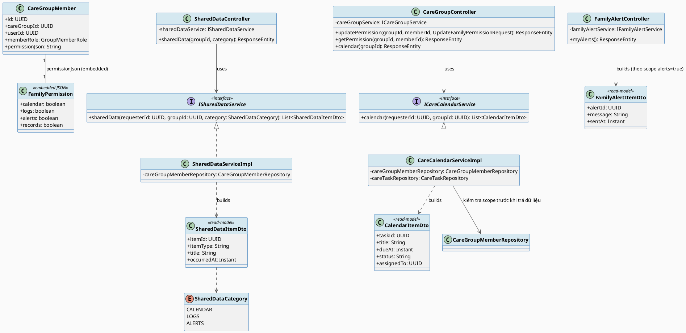
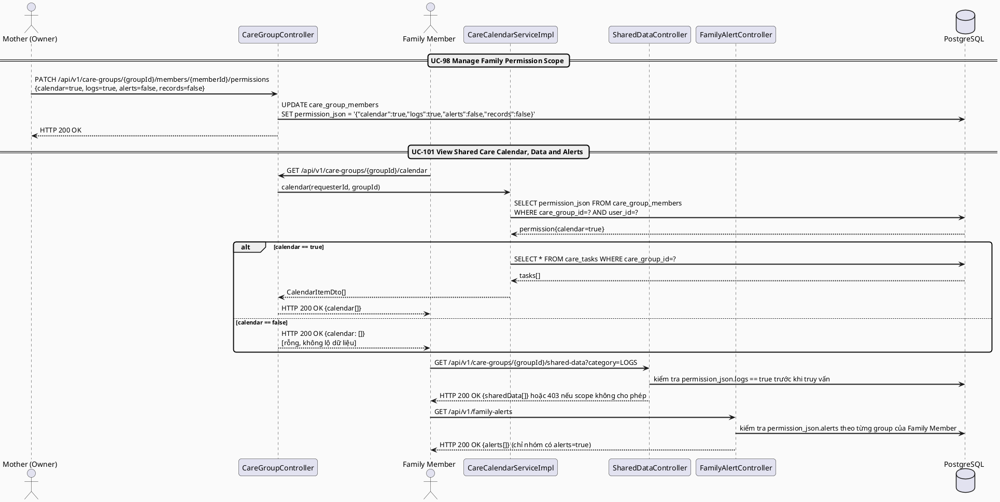
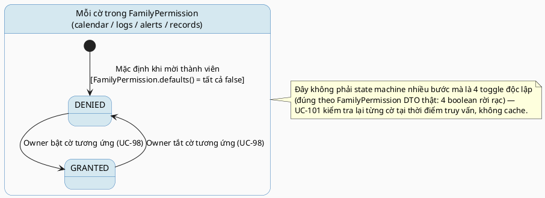

# MF-10 / Spec 02 — Family Permission Scope & Shared Care Visibility

| Field | Value |
| --- | --- |
| Feature | MF-10 — Family Sync & Cooperative Care |
| Use Cases Covered | UC-98 Manage Family Permission Scope, UC-101 View Shared Care Calendar, Data and Alerts |
| Primary Actor(s) | Mother (grants scope), Family Member (consumes within scope) |
| Platform | Mother Mobile App, Family Mobile App |
| Main Flow Summary | A Mother defines which categories of data (calendar, logs, alerts, records) a specific family member may see, stored as a per-membership permission scope; the family member then views only the calendar items, shared data and alerts allowed by their current scope — never more. |
| Grounding (source code) | `family/entity/CareGroupMember.java` (`permissionJson`), `family/dto/FamilyPermission.java`, `family/entity/PermissionFlag.java`, `family/entity/SharedDataCategory.java`, `family/controller/CareGroupController.java` (`/{groupId}/members/{memberId}/permissions`, `/{groupId}/calendar`), `family/controller/SharedDataController.java` (`/{groupId}/shared-data`), `family/controller/FamilyAlertController.java` (`/api/v1/family-alerts`) |

## 1. Tổng quan luồng chính (Main Flow Overview)

Đây là mô hình "consent nội bộ nhóm" của MF-10 — khác với `ConsentGrant` (MF-01, dùng cho
chia sẻ điểm-tới-điểm có hạn) hoặc `DataPermission` (MF-08, dùng cho chia sẻ với
chuyên gia). Ở đây, phạm vi quyền được lưu **trực tiếp trên `CareGroupMember.permissionJson`**
dưới dạng 4 cờ boolean (`calendar`/`logs`/`alerts`/`records` — DTO `FamilyPermission`),
do Owner cập nhật cho từng thành viên (UC-98). Mọi truy vấn dữ liệu chia sẻ của Family
Member (lịch chăm sóc UC-101, dữ liệu chia sẻ, cảnh báo gia đình) đều lọc lại theo đúng
scope hiện tại của `CareGroupMember` gọi request đó — không có bảng "shared calendar"
hay "shared data" vật lý riêng, tất cả là read-model được lọc lại từ dữ liệu gốc
(`CareTask`, `BabyDailyLog`, `FamilyAlertLog`...) theo permission.

## 2. Class Diagram

**Hình 1 — Class Diagram: Family Permission Scope & Shared Read-Models**

## 3. Sequence Diagram — Main Flow

**Hình 2 — Sequence Diagram: Owner Sets Scope → Family Member Views Calendar/Data/Alerts Within Scope (Main Flow)**

## 4. State Machine — Phạm vi quyền hiệu lực theo `SharedDataCategory` (per-category toggle)

**Hình 3 — State Machine: Family Permission Flag Toggle (`DENIED` ↔ `GRANTED`, per category)**

## 5. Business Rules Applied

- BR-RBAC — chỉ `OWNER` của care group được thay đổi `permissionJson` của thành viên.
- UC-98 — phạm vi quyền là theo từng thành viên (`memberId`), không áp dụng chung cho cả nhóm.
- UC-101 — mọi endpoint đọc dữ liệu chia sẻ đều kiểm tra lại cờ tương ứng tại thời điểm truy vấn; không trả dữ liệu vượt scope kể cả khi request hợp lệ về mặt xác thực.
- BR-PRIVACY — hồ sơ sức khỏe chi tiết (`records`) là cờ nhạy cảm nhất, mặc định `false`.
