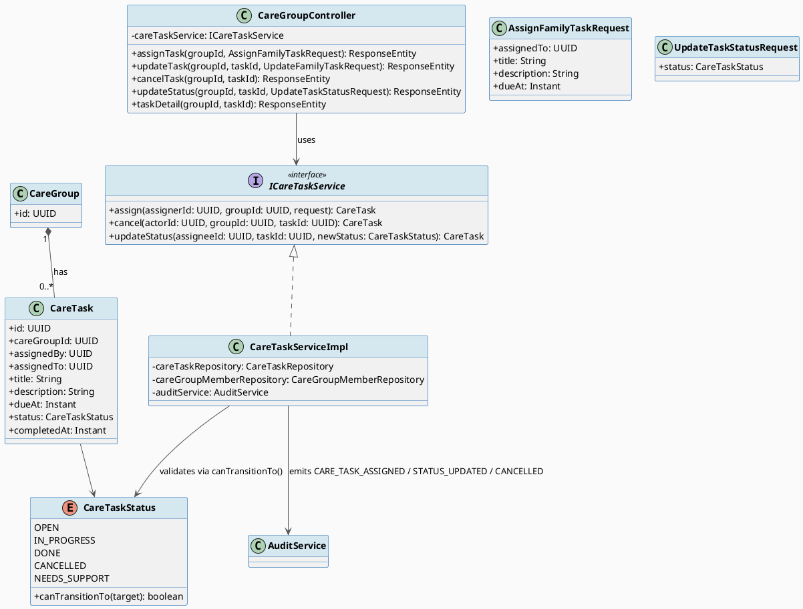
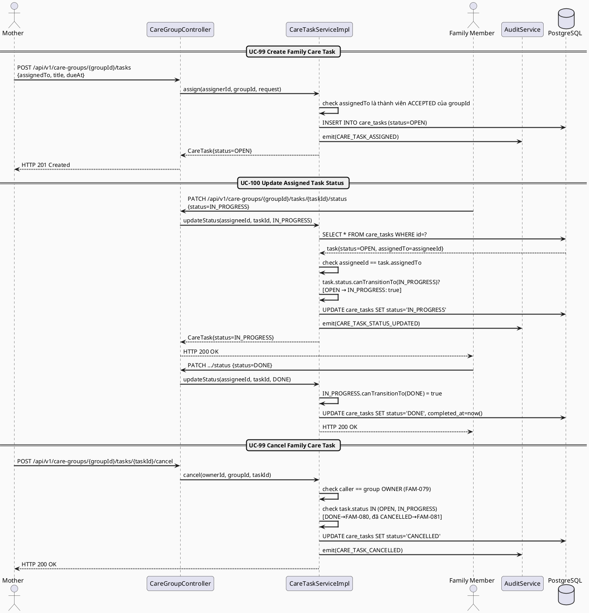
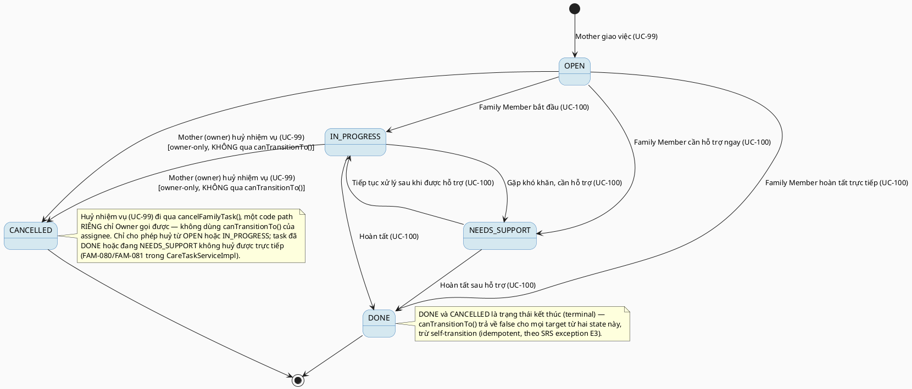

# MF-10 / Spec 03 — Family Care Task Assignment & Status Update

| Field | Value |
| --- | --- |
| Feature | MF-10 — Family Sync & Cooperative Care |
| Use Cases Covered | UC-99 Create, Update or Cancel Family Care Task, UC-100 Update Assigned Task Status |
| Primary Actor(s) | Mother (assigns), Family Member (executes) |
| Platform | Mother Mobile App, Family Mobile App |
| Main Flow Summary | A Mother assigns a care task to an eligible care-group member with a due time; the assignee progresses the task through an explicit finite-state machine (open → in progress → done, with a "needs support" branch) enforced server-side, not by free-form status strings. |
| Grounding (source code) | `family/entity/CareTask.java`, `family/entity/CareTaskStatus.java` (with `canTransitionTo()` guard, ADR-FAM-030/ADR-FAM-005), `family/controller/CareGroupController.java` (`/{groupId}/tasks`, `/{groupId}/tasks/{taskId}/status`) |

## 1. Tổng quan luồng chính (Main Flow Overview)

Đây là luồng cộng tác trực tiếp nhất của MF-10. Mother tạo `CareTask` gán cho một
`assignedTo` hợp lệ trong `CareGroup` (UC-99: create/update/cancel do Mother thực hiện).
Family Member được giao cập nhật trạng thái thực thi của chính task đó (UC-100) — điểm
đáng chú ý về grounding: `family.entity.CareTaskStatus` có hẳn một **FSM tường minh trong
code** (`canTransitionTo()`), khác với entity `reminder.entity.CareTask` (dùng nội bộ cho
"Today Tasks" ở MF-09, chỉ có OPEN/COMPLETED/CANCELLED đơn giản hơn) — hai entity trùng
tên nhưng phục vụ hai mục đích khác nhau; spec này dùng đúng entity `family` vì đó là nơi
UC-99/100 thật sự được implement (`CareGroupController`/`CareTaskServiceImpl`).

## 2. Class Diagram

**Hình 1 — Class Diagram: Family Care Task với FSM tường minh trong `CareTaskStatus`**

## 3. Sequence Diagram — Main Flow

**Hình 2 — Sequence Diagram: Assign Task → Update Status (OPEN→IN_PROGRESS→DONE) → Cancel (Main Flow)**

## 4. State Machine — `CareTaskStatus` (FSM thật trong code, `canTransitionTo()`)

**Hình 3 — State Machine: `CareTaskStatus` Lifecycle (đúng theo `canTransitionTo()` thật trong code)**

## 5. Business Rules Applied

- BR-RBAC — chỉ Mother (assigner/owner) tạo/sửa/huỷ task; chỉ đúng `assignedTo` mới cập nhật được status của task đó.
- UC-99/UC-100 — mọi chuyển trạng thái phải hợp lệ theo `CareTaskStatus.canTransitionTo()`; request chuyển trạng thái không hợp lệ (ví dụ `DONE → OPEN`) bị từ chối.
- Self-transition (cùng trạng thái) được cho phép — idempotent theo đặc tả lỗi E3 của SRS, tránh lỗi khi client gọi lại do mất kết nối.
- UC-99 postcondition — huỷ task (`CANCELLED`) chỉ áp dụng được từ `OPEN` hoặc `IN_PROGRESS`, chỉ do Owner thực hiện; task đã `DONE`, đã `CANCELLED`, hoặc đang `NEEDS_SUPPORT` không huỷ trực tiếp được (mã lỗi FAM-080/FAM-081).
