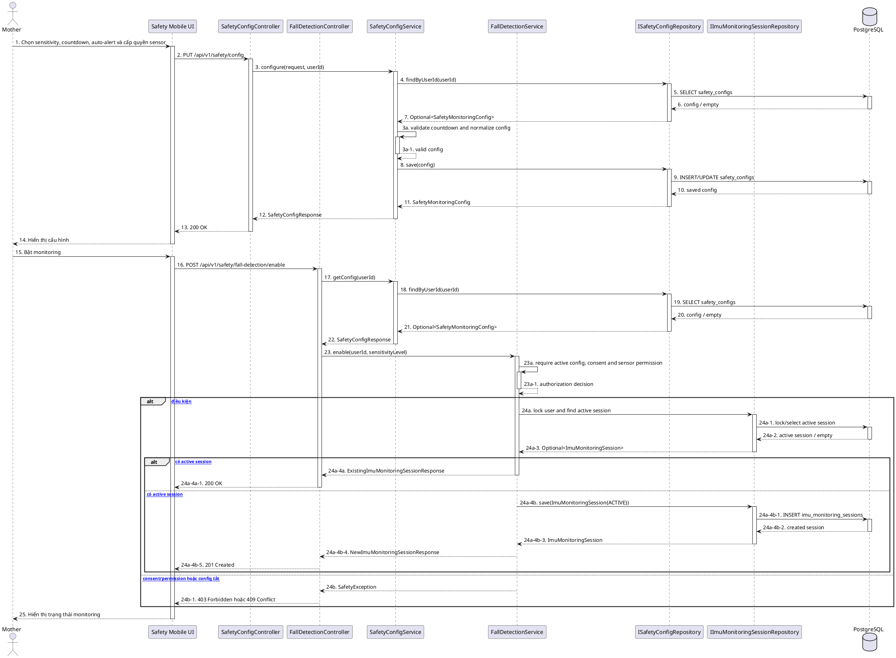

# MF-10 / Spec 01 — Smart Activity Monitoring Configuration & Session Control

| Field | Value |
| --- | --- |
| Feature | MF-10 — Smart Activity Monitoring & Safety Support |
| Use Cases Covered | Configure monitoring; record sensor permission; enable/disable phone IMU monitoring |
| Primary Actor(s) | Mother |
| Platform | Mother Mobile App, CareBridge API |
| Main Flow Summary | Mother configures sensitivity, countdown and auto-alert consent, grants sensor permission, then starts one active phone-IMU session. Disable stops the active session. |
| Grounding (source code) | `SafetyConfigController`, `SafetyConfigService`, `FallDetectionController`, `FallDetectionService`, `SafetyMonitoringConfig`, `ImuMonitoringSession`, Mobile `features/safety` |

## 1. Tổng quan luồng chính (Main Flow Overview)

Cấu hình an toàn là bản ghi 1-1 theo Mother, gồm bật phát hiện ngã, sensitivity, auto alert, countdown 15/30/60 giây và trạng thái quyền cảm biến. Bật monitoring chỉ thành công khi policy consent còn hiệu lực, cấu hình active và sensor permission đã được ghi nhận. Service khóa theo user và trả session đang active nếu request enable bị lặp; không tạo session song song. Tắt monitoring chuyển session sang `STOPPED`. Phạm vi này chỉ dùng cảm biến IMU của điện thoại; không bao gồm wearable/connected device hoặc paid real-time monitoring.

## 2. Class Diagram

```plantuml
@startuml MF10_01_MonitoringConfig_ClassDiagram
skinparam classAttributeIconSize 0
class SafetyMonitoringConfig { +id: UUID; +userId: UUID; +fallDetectionEnabled: boolean; +sensitivityLevel: SensitivityLevel; +emergencyAutoAlert: boolean; +countdownSeconds: int; +sensorPermissionGranted: boolean; +sensorPermissionRecordedAt: Instant }
class ImuMonitoringSession { +id: UUID; +userId: UUID; +status: ImuSessionStatus; +sensitivityLevel: String; +startedAt: Instant; +endedAt: Instant }
enum SensitivityLevel { LOW; MEDIUM; HIGH; +getThreshold(): double }
enum ImuSessionStatus { ACTIVE; STOPPED }
class SafetyConfigController
class SafetyConfigService
class FallDetectionController
class FallDetectionService
interface ISafetyConfigRepository
interface IImuMonitoringSessionRepository
SafetyMonitoringConfig --> SensitivityLevel
ImuMonitoringSession --> ImuSessionStatus
SafetyConfigController --> SafetyConfigService
SafetyConfigService --> ISafetyConfigRepository
FallDetectionController --> FallDetectionService
FallDetectionService --> IImuMonitoringSessionRepository
FallDetectionService --> ISafetyConfigRepository
@enduml
```

**Hình 1 — Class Diagram: Safety configuration và IMU monitoring session**

## 3. Sequence Diagram — Main Flow



**Hình 2 — Sequence Diagram: Lưu cấu hình và bật phone-IMU monitoring**

## 4. Business Rules Applied

- Chỉ Mother được cấu hình và điều khiển monitoring.
- `countdownSeconds` chỉ nhận 15, 30 hoặc 60; mặc định 30.
- Enable yêu cầu consent sensor, `sensorPermissionGranted=true` và cấu hình fall detection đang active.
- Mỗi user tối đa một session `ACTIVE`; enable lặp là idempotent theo active session.
- Disable chuyển active session sang `STOPPED`; IMU payload sau đó bị từ chối vì không có active session.
- Không thu thập wearable/connected-device stream và không có phạm vi paid 24/7 monitoring trong release này.
