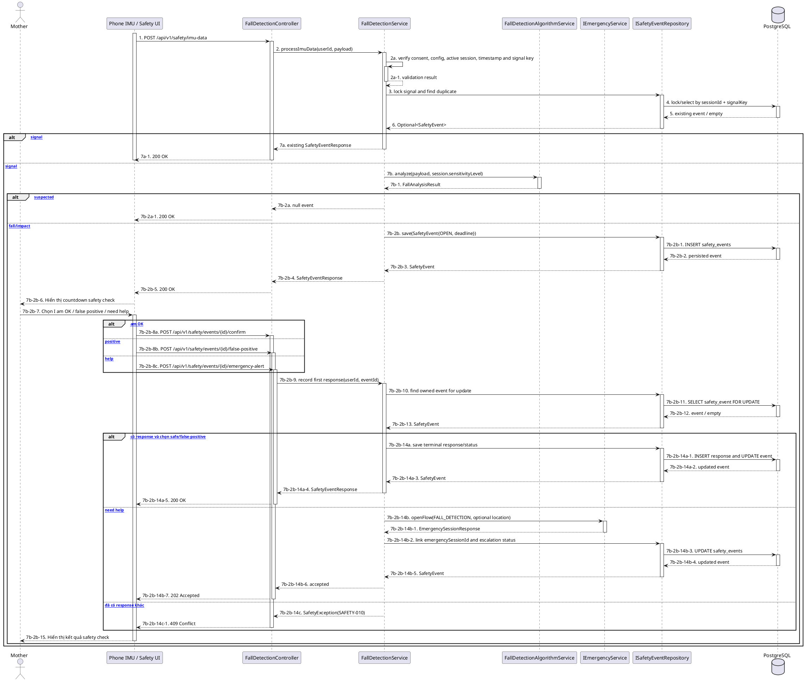

# MF-10 / Spec 02 — Suspected Fall Detection, Safety Check & Escalation

| Field | Value |
| --- | --- |
| Feature | MF-10 — Smart Activity Monitoring & Safety Support |
| Use Cases Covered | Process phone IMU signal; safety countdown; confirm safe; report false positive; request/auto-trigger emergency; view history |
| Primary Actor(s) | Mother, Phone IMU Sensor, Scheduled Countdown Job |
| Platform | Mother Mobile App, CareBridge API |
| Main Flow Summary | An active session accepts deduplicated IMU samples. A suspected fall creates an OPEN event and countdown. Mother responds safe/false-positive/help, or timeout applies configured auto-escalation into MF-07 emergency flow. |
| Grounding (source code) | `FallDetectionController`, `FallDetectionService`, `FallDetectionAlgorithmService`, `SafetyCountdownJob`, `SafetyEvent`, `SafetyEventResponseRecord`, `IEmergencyService` |

## 1. Tổng quan luồng chính (Main Flow Overview)

App gửi IMU sample kèm timestamp, signalId và location tùy consent. Service yêu cầu session `ACTIVE`, kiểm tra clock skew, khóa `sessionId:signalKey` để chống duplicate rồi chạy thuật toán theo sensitivity snapshot của session. Sample không nghi ngờ trả response rỗng; sample nghi ngờ tạo `SafetyEvent OPEN` với deadline. Mother có đúng một response đầu tiên: `I_AM_OK`, `FALSE_POSITIVE` hoặc `NEED_HELP`. Khi hết countdown, job chọn `TIMED_OUT` hoặc `ESCALATION_REQUESTED` theo `emergencyAutoAlert`. Escalation gọi `IEmergencyService.openFlow`; trạng thái chỉ thành `EMERGENCY_ALERT_SENT` sau khi emergency/family alert được liên kết thành công.

## 2. Class Diagram

```plantuml
@startuml MF10_02_FallDetection_ClassDiagram
skinparam classAttributeIconSize 0
class ImuMonitoringSession { +id: UUID; +userId: UUID; +status: ImuSessionStatus; +sensitivityLevel: String }
class SafetyEvent { +id: UUID; +userId: UUID; +imuSessionId: UUID; +signalKey: String; +eventType: SafetyEventType; +magnitude: BigDecimal; +detectedAt: Instant; +countdownDeadlineAt: Instant; +status: SafetyEventStatus; +responseType: String; +emergencySessionId: UUID }
class SafetyEventResponseRecord { +safetyEventId: UUID; +responseType: String; +reason: String; +respondedAt: Instant }
enum SafetyEventStatus { OPEN; TEST_OPEN; CONFIRMED_SAFE; FALSE_POSITIVE; TIMED_OUT; ESCALATION_REQUESTED; EMERGENCY_ALERT_SENT }
class FallDetectionController
class FallDetectionService
interface IFallDetectionAlgorithmService
interface ISafetyEventRepository
interface IEmergencyService
ImuMonitoringSession "1" --> "0..*" SafetyEvent
SafetyEvent "1" --> "0..1" SafetyEventResponseRecord
SafetyEvent --> SafetyEventStatus
FallDetectionController --> FallDetectionService
FallDetectionService --> IFallDetectionAlgorithmService
FallDetectionService --> ISafetyEventRepository
FallDetectionService --> IEmergencyService
@enduml
```

**Hình 1 — Class Diagram: Safety event, response và emergency linkage**

## 3. Sequence Diagram — Main Flow



**Hình 2 — Sequence Diagram: IMU detection, phản hồi và emergency escalation**

## 4. Business Rules Applied

- Chỉ nhận signal khi consent còn hiệu lực, sensor permission được cấp và có session `ACTIVE`.
- Timestamp vượt quá độ lệch cho phép bị từ chối; `(sessionId, signalKey)` phải idempotent.
- Location chỉ được persist khi payload có tọa độ và policy cho phép.
- Một safety event chỉ nhận response đầu tiên; replay cùng response là idempotent, response khác trả `409 Conflict`.
- Sensor self-test không được kích hoạt emergency alert.
- Timeout tự động chỉ escalation khi `emergencyAutoAlert=true`; nếu không, event thành `TIMED_OUT`.
- `EMERGENCY_ALERT_SENT` chỉ phản ánh emergency session đã gửi alert; phát hiện nghi ngờ không tự đồng nghĩa đã gọi người thân.
- Không bao gồm wearable/connected-device ingestion hoặc dịch vụ giám sát trả phí thời gian thực.
