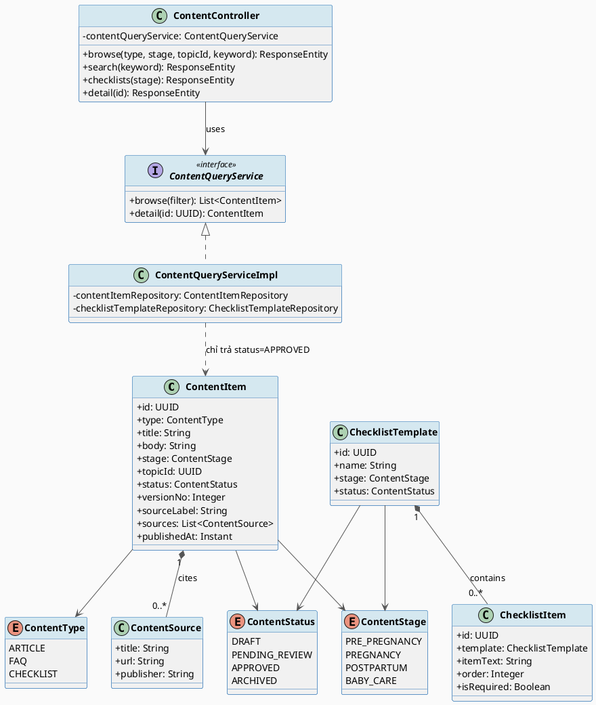
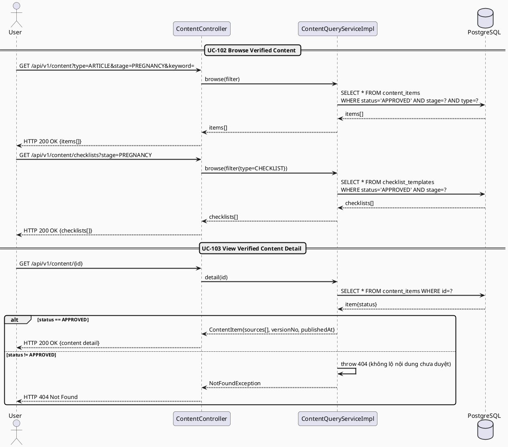
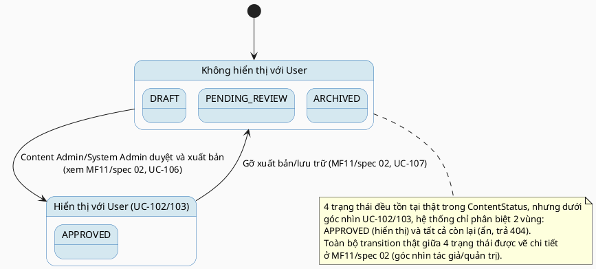

# MF-11 / Spec 01 — Verified Content Browse & Consumption

| Field | Value |
| --- | --- |
| Feature | MF-11 — Verified Content & Checklist Hub |
| Use Cases Covered | UC-102 Browse Verified Content, UC-103 View Verified Content Detail |
| Primary Actor(s) | User (Mother / Family / any authenticated User) |
| Platform | Mobile App |
| Main Flow Summary | A User browses reviewed articles, FAQs and checklists with embedded keyword/stage/topic filters, then opens the detail view of a selected item showing its body, sources, review/version state and safety notes. Only content that has passed the authoring/review pipeline (spec 02) is ever visible here. |
| Grounding (source code) | `content/entity/ContentItem.java`, `ContentStatus.java`, `ContentType.java`, `ContentStage.java`, `ContentSource.java`, `content/controller/ContentController.java` (`/api/v1/content`) |

## 1. Tổng quan luồng chính (Main Flow Overview)

Đây là mặt tiêu dùng (consumer-facing) của cùng entity `ContentItem` mà spec 02 quản trị
vòng đời tạo/duyệt/xuất bản. Luồng ở đây đơn giản và có chủ đích: User chỉ **nhìn thấy**
nội dung ở `status=APPROVED` (UC-102, filter từ khoá/giai đoạn/chủ đề là điều khiển nhúng
theo D-02), rồi mở chi tiết một item để xem đầy đủ nguồn (`ContentSource[]`), số phiên bản
(`versionNo`) và ngày cập nhật (UC-103). Checklist (`ChecklistTemplate`/`ChecklistItem`)
dùng chung `ContentStage`/`ContentStatus` nên hiển thị theo đúng cơ chế lọc như
article/FAQ, không cần luồng riêng.

## 2. Class Diagram

**Hình 1 — Class Diagram: Content Item, Source & Checklist Template (Consumer View)**

## 3. Sequence Diagram — Main Flow

**Hình 2 — Sequence Diagram: Browse (Embedded Filter) → View Detail (Main Flow)**

## 4. State Machine — `ContentItem.status` (góc nhìn hiển thị cho User)

**Hình 3 — State Machine: `ContentItem.status` — Visibility Gate cho User**

## 5. Business Rules Applied

- UC-102 — chỉ nội dung `APPROVED` được liệt kê; filter từ khoá/giai đoạn/chủ đề là điều khiển nhúng (D-02), không tách UC riêng.
- UC-103 — nội dung chưa duyệt trả 404 thay vì 403, để không tiết lộ sự tồn tại của bản nháp cho User thường.
- Excluded (SRS 4.8) — nội dung không thay thế tư vấn y khoa chính thức; mỗi item giữ `sourceLabel`/`sources[]` để minh bạch nguồn gốc.
