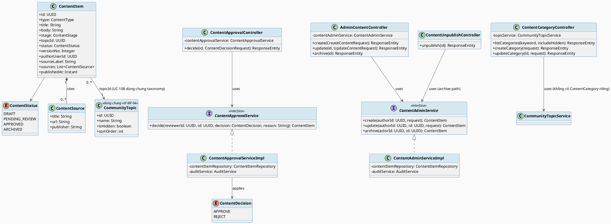
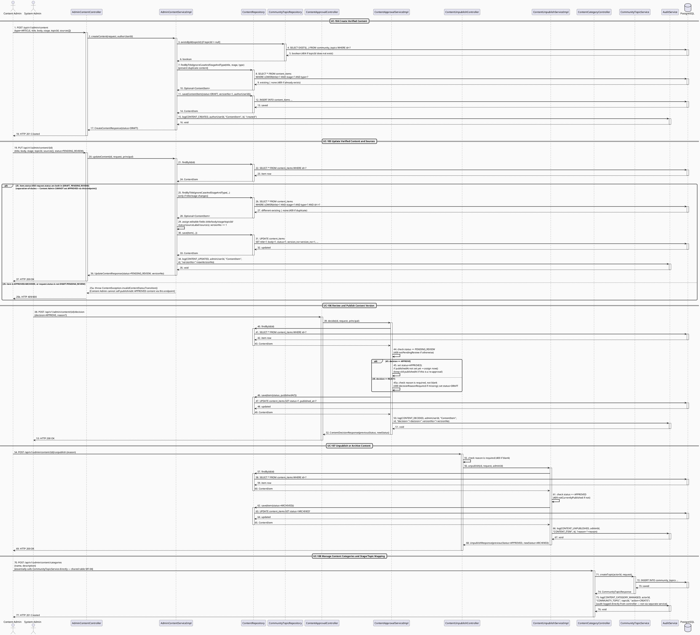
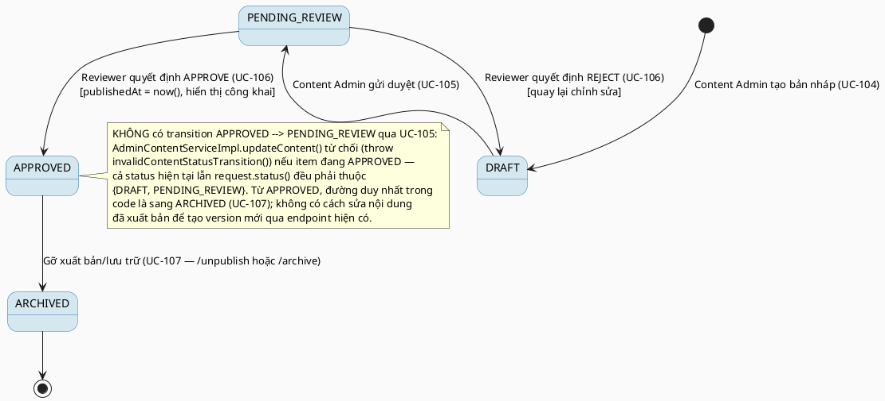

# MF-11 / Spec 02 — Content Authoring, Review & Publishing Lifecycle

| Field | Value |
| --- | --- |
| Feature | MF-11 — Verified Content & Checklist Hub |
| Use Cases Covered | UC-104 Create Verified Content, UC-105 Update Verified Content and Sources, UC-106 Review and Publish Content Version, UC-107 Unpublish or Archive Content, UC-108 Manage Content Categories and Stage/Topic Mapping |
| Primary Actor(s) | Content Admin, System Admin |
| Platform | Admin Portal |
| Main Flow Summary | A Content Admin drafts an article/FAQ/checklist mapped to a stage and topic, a System Admin (or Content Admin with review rights) reviews the version and approves or rejects it before it becomes publicly visible, and either admin can later unpublish/archive outdated or unsafe content. Category/topic taxonomy is managed through the same topic service that backs MF-04's community topics. |
| Grounding (source code) | `content/entity/ContentItem.java`, `ContentStatus.java`, `ContentDecision.java`, `content/controller/AdminContentController.java` (`/api/v1/admin/content`), `ContentApprovalController.java` (`/{id}/decision`), `ContentUnpublishController.java` (`/{id}/unpublish`), `ContentCategoryController.java` (`/api/v1/admin/content/categories`, reuses `CommunityTopicService`) |

## 1. Tổng quan luồng chính (Main Flow Overview)

`ContentItem.status` là trục chính của toàn bộ vòng đời quản trị nội dung:
`DRAFT` (Content Admin tạo — UC-104) → `PENDING_REVIEW` (gửi duyệt sau khi sửa nội dung/
nguồn — UC-105) → `APPROVED`/quay lại `DRAFT` (System Admin hoặc Content Admin có quyền
review quyết định qua `ContentDecision` APPROVE/REJECT — UC-106) → `ARCHIVED` (gỡ xuất
bản khi lỗi thời/không an toàn — UC-107). **Ghi chú grounding:** UC-108 (quản lý danh
mục/stage-topic mapping) trong code hiện tại **không có entity `ContentCategory` riêng**
— `ContentCategoryController` gọi thẳng `CommunityTopicService` (cùng bảng
`community_topics` mà MF-04 dùng cho chủ đề cộng đồng). Nghĩa là "danh mục nội dung" và
"chủ đề cộng đồng" hiện là **cùng một taxonomy dùng chung**, không phải hai khái niệm
tách biệt như tên UC gợi ý — spec này trình bày đúng thực tế đó thay vì vẽ một
`ContentCategory` không tồn tại.

## 2. Class Diagram

**Hình 1 — Class Diagram: Content Item Lifecycle & Shared Topic Taxonomy**

## 3. Sequence Diagram — Main Flow

**Hình 2 — Sequence Diagram: Create Draft (dedup + topic check) → Update/Submit (guarded) → Review Decision → Unpublish → Manage Categories (Main Flow)**

> **Ghi chú grounding (quan trọng — sửa lại State Machine mục 4):**
> 1. `AdminContentServiceImpl.updateContent` (PUT, UC-105) **từ chối** nếu
>    `item.getStatus() == APPROVED` — cả trạng thái hiện tại của item lẫn `request.status()`
>    đều bắt buộc thuộc `{DRAFT, PENDING_REVIEW}`, nếu không sẽ `throw
>    invalidContentStatusTransition()`. Do đó transition `APPROVED --> PENDING_REVIEW` vẽ ở
>    State Machine mục 4 (note "Content Admin sửa nội dung đã xuất bản") **không đúng với
>    code hiện tại** — Content Admin không thể sửa trực tiếp một content đã `APPROVED` qua
>    endpoint này; cần một quyết định `REJECT` (UC-106) hoặc endpoint riêng chưa tồn tại để
>    đưa nó về `DRAFT`/`PENDING_REVIEW` trước.
> 2. UC-107 ("Unpublish or Archive") thực chất ánh xạ tới **hai endpoint riêng biệt** với
>    guard khác nhau: `ContentUnpublishController` (`POST /{id}/unpublish`, chỉ
>    `CONTENT_ADMIN`, yêu cầu `status` hiện tại phải đang `APPROVED`) và
>    `AdminContentController.hideContent` (`POST /{id}/archive`, cũng `CONTENT_ADMIN`, cho
>    phép archive từ **bất kỳ** status khác `ARCHIVED`, không riêng `APPROVED`). Sơ đồ trên
>    chỉ vẽ đường `/unpublish`; `/archive` có cùng shape nhưng thiếu guard "phải đang
>    APPROVED".
> 3. `ContentApprovalServiceImpl.decide` bắt buộc `reason` không rỗng khi `REJECT` (APPROVE
>    thì `reason` tuỳ chọn), và chỉ gán `publishedAt` nếu trước đó **chưa từng** có giá trị —
>    giữ nguyên ngày xuất bản gốc qua các lần duyệt lại sau này. Cả hai chi tiết này chưa
>    từng được vẽ ở bản trước.

## 4. State Machine — `ContentItem.status` (góc nhìn tác giả/quản trị)

**Hình 3 — State Machine: `ContentItem.status` — Full Authoring FSM**

## 5. Business Rules Applied

- BR-RBAC — tạo/sửa nội dung thuộc Content Admin; quyết định duyệt (APPROVE/REJECT) thuộc System Admin hoặc Content Admin có quyền review riêng (không phải người tự tạo nội dung đó, separation-of-duties).
- UC-106 — chỉ nội dung `PENDING_REVIEW` mới nhận quyết định; version đã `APPROVED` trước đó không bị ảnh hưởng cho tới khi version mới được duyệt.
- UC-107 — chỉ gỡ xuất bản/lưu trữ nội dung `APPROVED`; không xoá cứng để giữ lịch sử tham chiếu.
- UC-108 — danh mục/chủ đề nội dung dùng chung taxonomy với MF-04 (`CommunityTopic`), chỉ Content Admin quản lý được (`@PreAuthorize("hasRole('CONTENT_ADMIN')")`).
