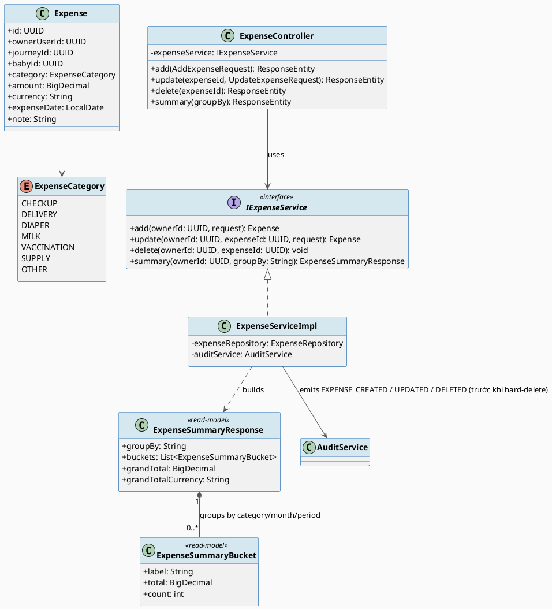
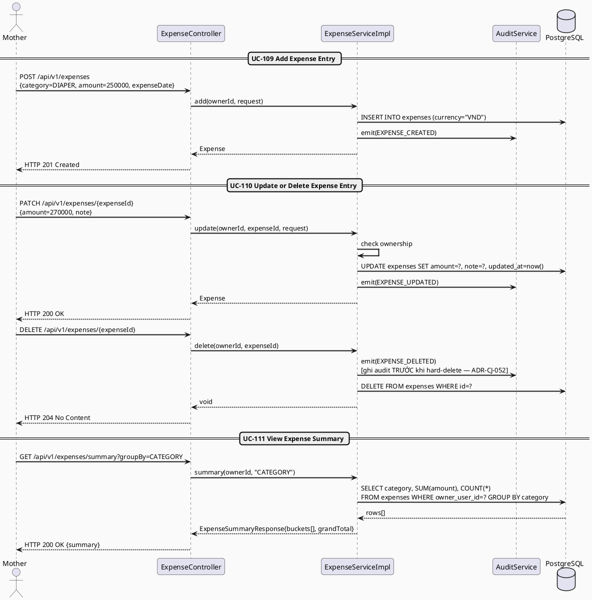
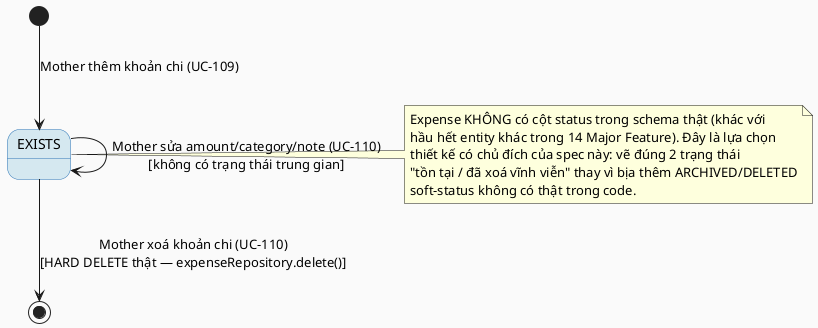

# MF-12 / Spec 01 — Preparation Expense Entry & Summary

| Field | Value |
| --- | --- |
| Feature | MF-12 — Expense & Preparation Planner |
| Use Cases Covered | UC-109 Add Expense Entry, UC-110 Update or Delete Expense Entry, UC-111 View Expense Summary |
| Primary Actor(s) | Mother |
| Platform | Mother Mobile App |
| Main Flow Summary | A Mother records a preparation expense with category/amount/date, may correct or permanently delete it, and views simple totals grouped by category, month or journey/baby period. This is a personal record-keeping tool, not accounting/billing/insurance software. |
| Grounding (source code) | `carejourney/entity/Expense.java`, `ExpenseCategory.java`, `carejourney/controller/ExpenseController.java` (`/api/v1/expenses`), `carejourney/service/impl/ExpenseServiceImpl.java` |

## 1. Tổng quan luồng chính (Main Flow Overview)

MF-12 là tính năng đơn giản nhất trong toàn bộ 14 Major Feature: `Expense` không có cột
`status` — sửa (UC-110) ghi đè trực tiếp, xoá (UC-110) là **hard delete thật** (xem
`ExpenseServiceImpl.deleteExpense()`: `expenseRepository.delete(expense)`, có audit trước
khi xoá nhưng không giữ bản ghi lại). Vì vậy state machine của spec này **cố tình tối
giản** (tồn tại → bị xoá vĩnh viễn) thay vì vẽ thêm trạng thái giả định như `ARCHIVED` —
đúng tinh thần "không thêm trạng thái suy diễn để trông đầy đủ hơn" đã nêu ở README mục 3.
UC-111 (xem tổng hợp) là phép nhóm/tổng đơn giản theo `category`/tháng/`journeyId`/
`babyId`, không phải entity riêng.

## 2. Class Diagram

**Hình 1 — Class Diagram: Expense Entry & Summary Read-Model**

## 3. Sequence Diagram — Main Flow

**Hình 2 — Sequence Diagram: Add → Update/Delete → View Summary (Main Flow)**

## 4. State Machine — `Expense` Record Lifecycle (tối giản, không có cột status)

**Hình 3 — State Machine: Expense Record Lifecycle (`EXISTS` → hard-deleted)**

## 5. Business Rules Applied

- BR-RBAC / ownership — chỉ chủ sở hữu (`ownerUserId`) thêm/sửa/xoá được khoản chi của chính họ.
- UC-110 — xoá là hành động không thể hoàn tác (hard delete); `AuditService` ghi log **trước** khi xoá để giữ dấu vết dù bản ghi gốc không còn (ADR-CJ-052).
- UC-111 — summary chỉ tổng hợp dữ liệu của chính Mother, nhóm theo `category`/tháng/`journeyId`/`babyId` tuỳ tham số `groupBy`.
- Excluded (SRS MF-12 description) — đây không phải công cụ kế toán, hoá đơn, bảo hiểm hay tư vấn tài chính.
