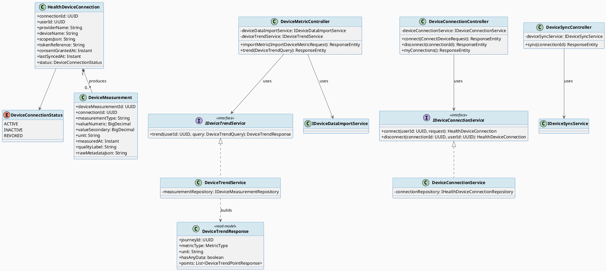
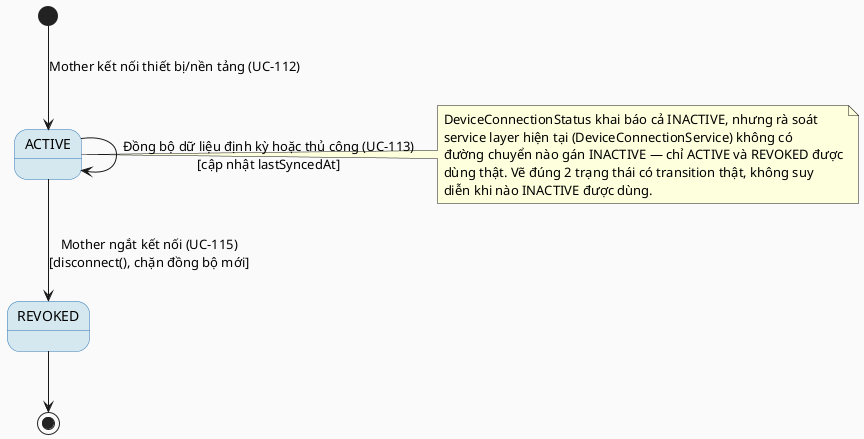

# MF-13 / Spec 01 — Connected Device: Connection, Sync, Trend & Disconnect Lifecycle

| Field | Value |
| --- | --- |
| Feature | MF-13 — Connected Device & Health Data Integration |
| Use Cases Covered | UC-112 Connect Health Device or Platform, UC-113 Import or Synchronize Device Observations, UC-114 View Device Data Trend and Quality, UC-115 Disconnect Device and Delete Imported Data |
| Primary Actor(s) | Mother |
| Platform | Mother Mobile App |
| Main Flow Summary | A Mother connects a supported device/platform after reviewing permission scope, the app imports or synchronizes selected observations (heart rate, sleep, steps, SpO2, temperature, blood pressure), she reviews trend and data-quality labels, and can disconnect to stop future sync. This is presented as one continuous end-to-end pipeline rather than four separate specs because each step only makes sense in sequence. |
| Grounding (source code) | `health/device/entity/HealthDeviceConnection.java`, `DeviceConnectionStatus.java`, `health/device/entity/DeviceMeasurement.java`, `health/device/controller/DeviceConnectionController.java` (`/api/v1/health/devices/connections`), `DeviceSyncController.java` (`/{id}/sync`), `DeviceMetricController.java` (`/api/v1/health/metrics/device-import`, `/trend`) |

## 1. Tổng quan luồng chính (Main Flow Overview)

`HealthDeviceConnection` được tạo sau khi Mother xem và chấp nhận phạm vi quyền
(`scopesJson`) cho một `providerName` (UC-112). Đồng bộ dữ liệu (UC-113) tạo các
`DeviceMeasurement` gắn `connectionId`, giữ `qualityLabel` và `rawMetadataJson` để minh
bạch nguồn/chất lượng — các measurement này đồng thời được ánh xạ sang
`MaternalHealthMetric` (MF-02) với `sourceType=DEVICE` để hiển thị chung trong trend của
mẹ. UC-114 dùng lại chính `DeviceMeasurement` để vẽ xu hướng kèm cảnh báo chất lượng
(`accuracyWarning`). Ngắt kết nối (UC-115) chuyển `status=REVOKED`, ngăn đồng bộ mới.
**Ghi chú grounding:** trong code hiện tại, `disconnect()` chỉ đổi `status`, **chưa có**
bước xoá cứng `DeviceMeasurement` đã nhập đi kèm (nửa "delete imported data" của UC-115
chưa có cài đặt tự động) — spec này nêu rõ để không đánh giá sai UC-115 là đã hoàn chỉnh.

## 2. Class Diagram

**Hình 1 — Class Diagram: Device Connection, Measurement & Trend Read-Model**

## 3. Sequence Diagram — Main Flow

```plantuml
@startuml MF13_01_DeviceIntegration_SequenceDiagram
skinparam sequenceArrowThickness 2
skinparam roundcorner 10
skinparam backgroundColor #FAFAFA

actor "Mother" as M
participant "DeviceConnectionController" as ConnController
participant "DeviceConnectionService" as ConnService
participant "IHealthDeviceConnectionRepository" as ConnRepo
participant "DeviceSyncController" as SyncController
participant "DeviceSyncService" as SyncService
participant "WearableProviderClient" as ProviderClient
participant "IDeviceMeasurementRepository" as MeasurementRepo
participant "DeviceMetricController" as MetricController
participant "DeviceDataImportService" as ImportService
participant "MotherJourneyRepository" as JourneyRepo
participant "MaternalHealthMetricRepository" as MetricRepo
participant "DeviceTrendService" as TrendService
database "PostgreSQL" as DB

== UC-112 Connect Health Device or Platform ==
M -> ConnController : 1. POST /api/v1/health/devices/connections\n{providerName, deviceName, scopes[], tokenReference, consentAccepted=true}
activate ConnController
ConnController -> ConnService : 2. connect(request, userId)
activate ConnService
ConnService -> ConnService : 3. check consentAccepted=true (400 DEVICE-002 if not)
ConnService -> ConnRepo : 4. findFirstByUserIdAndProviderNameAndStatusOrderByCreatedAtDesc\n(userId, providerName, ACTIVE)
activate ConnRepo
ConnRepo -> DB : 5. SELECT * FROM health_device_connections\nWHERE user_id=? AND provider_name=? AND status='ACTIVE'\nORDER BY created_at DESC LIMIT 1
activate DB
DB --> ConnRepo : 6. existing | none
deactivate DB
ConnRepo --> ConnService : 7. Optional<HealthDeviceConnection>
deactivate ConnRepo
alt 8. no ACTIVE connection for this provider yet
  ConnService -> ConnRepo : 8. save(HealthDeviceConnection{status=ACTIVE,\nconsentGrantedAt=now()})
  activate ConnRepo
  ConnRepo -> DB : 9. INSERT INTO health_device_connections ...
  activate DB
  DB --> ConnRepo : 10. saved
  deactivate DB
  ConnRepo --> ConnService : 11. HealthDeviceConnection
  deactivate ConnRepo
  ConnService -> ConnService : 12. publishEvent(DeviceConnected)
  ConnService --> ConnController : 13. HealthDeviceConnection{status=ACTIVE}
  deactivate ConnService
  ConnController --> M : 14. HTTP 201 Created
  deactivate ConnController
else 8. ACTIVE connection already exists for this provider → idempotent, return old record
  ConnService --> ConnController : 8a. HealthDeviceConnection already exists (DO NOT create new)
  deactivate ConnService
  ConnController --> M : 8b. HTTP 201 Created (idempotent)
  deactivate ConnController
end

== UC-113 Import or Synchronize Device Observations ==
M -> SyncController : 15. POST /api/v1/health/devices/connections/{id}/sync
activate SyncController
SyncController -> SyncService : 16. syncNow(connectionId, userId)
activate SyncService
SyncService -> ConnRepo : 17. findByConnectionIdAndUserId(connectionId, userId)
activate ConnRepo
ConnRepo -> DB : 18. SELECT * FROM health_device_connections\nWHERE connection_id=? AND user_id=?
activate DB
DB --> ConnRepo : 19. connection row (404 SYNC-001 if not found)
deactivate DB
ConnRepo --> SyncService : 20. HealthDeviceConnection
deactivate ConnRepo
SyncService -> SyncService : 21. check status==ACTIVE && consentGrantedAt != null\n(409 SYNC-002 if not)
SyncService -> ProviderClient : 22. fetchMeasurements(connection)\n[call real device provider API — e.g. Fitbit/Google Fit]
activate ProviderClient
ProviderClient --> SyncService : 23. RawMeasurement[]\n(502 SYNC-003 if provider error — lastSyncedAt is still updated)
deactivate ProviderClient
loop 24-28. for each RawMeasurement returned
  SyncService -> MeasurementRepo : 24. existsByConnectionIdAndSourceRecordId\n(connectionId, sourceRecordId) [prevent duplicate import]
  activate MeasurementRepo
  MeasurementRepo -> DB : 25. SELECT EXISTS(...) FROM device_measurements\nWHERE connection_id=? AND source_record_id=?
  activate DB
  DB --> MeasurementRepo : 26. boolean
  deactivate DB
  MeasurementRepo --> SyncService : 27. boolean\n(skip if true — "Duplicate source record skipped")
  deactivate MeasurementRepo
  opt 28. never imported (no duplicate)
    SyncService -> MeasurementRepo : 28a. save(DeviceMeasurement{qualityLabel, rawMetadataJson})
    activate MeasurementRepo
    MeasurementRepo -> DB : 28b. INSERT INTO device_measurements ...
    activate DB
    DB --> MeasurementRepo : 28c. saved
    deactivate DB
    MeasurementRepo --> SyncService : 28d. DeviceMeasurement
    deactivate MeasurementRepo
  end
end
SyncService -> ConnRepo : 29. save(connection{lastSyncedAt=now()})\n[always update, even when records are skipped]
activate ConnRepo
ConnRepo -> DB : 30. UPDATE health_device_connections SET last_synced_at=now()
activate DB
DB --> ConnRepo : 31. updated
deactivate DB
ConnRepo --> SyncService : 32. HealthDeviceConnection
deactivate ConnRepo
SyncService -> SyncService : 33. publishEvent(DeviceDataSynced{syncedCount, skippedCount})
SyncService --> SyncController : 34. DeviceSyncResultResponse{syncedCount, skippedCount, skippedReasons[]}
deactivate SyncService
SyncController --> M : 35. HTTP 200 OK {syncResult}
deactivate SyncController

M -> MetricController : 36. POST /api/v1/health/metrics/device-import\n{journeyId, metricType, valueNumeric, unit, measuredAt,\nsourceType=DEVICE, deviceConnectionId}
activate MetricController
MetricController -> ImportService : 37. importMetric(request, userId)
activate ImportService
ImportService -> JourneyRepo : 38. existsByIdAndOwnerUserId(journeyId, userId)\n(403 DEVICE-004 if not owner of journey)
activate JourneyRepo
JourneyRepo -> DB : 39. SELECT EXISTS(...) FROM mother_journeys\nWHERE id=? AND owner_user_id=?
activate DB
DB --> JourneyRepo : 40. boolean
deactivate DB
JourneyRepo --> ImportService : 41. boolean
deactivate JourneyRepo
ImportService -> ImportService : 42. check valueNumeric is in allowable range according to metricType\n(400 DEVICE-100 if metricType has no range defined,\n400 DEVICE-101 if out of range)
alt 43. sourceType == DEVICE
  ImportService -> ConnRepo : 43. findByConnectionIdAndUserId(deviceConnectionId, userId)\n[must be ACTIVE — 409 DEVICE-102 if not]
  activate ConnRepo
  ConnRepo -> DB : 44. SELECT * FROM health_device_connections\nWHERE connection_id=? AND user_id=? AND status='ACTIVE'
  activate DB
  DB --> ConnRepo : 45. connection row
  deactivate DB
  ConnRepo --> ImportService : 46. HealthDeviceConnection (sourceReferenceId = connectionId)
  deactivate ConnRepo
else 43. sourceType == MANUAL (not via device)
  ImportService -> ImportService : 43a. sourceReferenceId = null
end
ImportService -> MetricRepo : 47. save(MaternalHealthMetric{sourceType, sourceReferenceId, status=ACTIVE})
activate MetricRepo
MetricRepo -> DB : 48. INSERT INTO maternal_health_metrics ...
activate DB
DB --> MetricRepo : 49. saved
deactivate DB
MetricRepo --> ImportService : 50. MaternalHealthMetric
deactivate MetricRepo
ImportService -> ImportService : 51. publishEvent(DeviceDataImported)
ImportService --> MetricController : 52. ImportDeviceMetricResponse
deactivate ImportService
MetricController --> M : 53. HTTP 201 Created
deactivate MetricController

== UC-114 View Device Data Trend and Quality ==
M -> MetricController : 54. GET /api/v1/health/metrics/trend?journeyId=&metricType=HEART_RATE&from=&to=
activate MetricController
MetricController -> TrendService : 55. getTrend(query, userId)
activate TrendService
TrendService -> TrendService : 56. check from <= to (400 DEVICE-301 if reversed)
TrendService -> JourneyRepo : 57. existsById(journeyId) (404 DEVICE-302 if not exists)
activate JourneyRepo
JourneyRepo -> DB : 58. SELECT EXISTS(...) FROM mother_journeys WHERE id=?
activate DB
DB --> JourneyRepo : 59. boolean
deactivate DB
JourneyRepo --> TrendService : 60. boolean
deactivate JourneyRepo
TrendService -> JourneyRepo : 61. existsByIdAndOwnerUserId(journeyId, userId)\n(403 DEVICE-304 if not owner of journey)
activate JourneyRepo
JourneyRepo -> DB : 62. SELECT EXISTS(...) FROM mother_journeys\nWHERE id=? AND owner_user_id=?
activate DB
DB --> JourneyRepo : 63. boolean
deactivate DB
JourneyRepo --> TrendService : 64. boolean
deactivate JourneyRepo
TrendService -> MetricRepo : 65. findByJourneyIdAndMetricTypeAndMeasuredAtBetweenAndStatus\nOrderByMeasuredAtAsc(journeyId, metricType, from, to, ACTIVE)\n[read from MaternalHealthMetric — NOT directly from DeviceMeasurement]
activate MetricRepo
MetricRepo -> DB : 66. SELECT * FROM maternal_health_metrics\nWHERE journey_id=? AND metric_type=? AND measured_at BETWEEN ?\nAND status='ACTIVE' ORDER BY measured_at ASC
activate DB
DB --> MetricRepo : 67. metrics[]
deactivate DB
MetricRepo --> TrendService : 68. metrics[]
deactivate MetricRepo
TrendService -> TrendService : 69. map → DeviceTrendPointResponse[]\n(sourceLabel inferred from HealthDeviceConnection if sourceType=DEVICE;\naccuracyWarning ALWAYS hard-coded false — see grounding notes)
TrendService --> MetricController : 70. DeviceTrendResponse{points[], hasAnyData}
deactivate TrendService
MetricController --> M : 71. HTTP 200 OK {trend}
deactivate MetricController

== UC-115 Disconnect Device and Delete Imported Data ==
M -> ConnController : 72. PATCH /api/v1/health/devices/connections/{id}/disconnect
activate ConnController
ConnController -> ConnService : 73. disconnect(connectionId, userId)
activate ConnService
ConnService -> ConnRepo : 74. findById(connectionId)
activate ConnRepo
ConnRepo -> DB : 75. SELECT * FROM health_device_connections WHERE connection_id=?
activate DB
DB --> ConnRepo : 76. connection row (409 DEVICE-203 if not found)
deactivate DB
ConnRepo --> ConnService : 77. HealthDeviceConnection
deactivate ConnRepo
ConnService -> ConnService : 78. check matching userId (403 DEVICE-204 if not)\n&& status==ACTIVE (409 DEVICE-203 if REVOKED/INACTIVE)
ConnService -> ConnRepo : 79. save(connection{status=REVOKED})
activate ConnRepo
ConnRepo -> DB : 80. UPDATE health_device_connections SET status='REVOKED'
activate DB
DB --> ConnRepo : 81. updated
deactivate DB
ConnRepo --> ConnService : 82. HealthDeviceConnection
deactivate ConnRepo
ConnService -> ConnService : 83. publishEvent(DeviceDisconnected)
ConnService --> ConnController : 84. HealthDeviceConnection{status=REVOKED}
deactivate ConnService
ConnController --> M : 85. HTTP 200 OK
deactivate ConnController
note right of ConnService
  Only change status → prevent new sync (SyncService checks ACTIVE
  before sync). "Delete imported data" (delete imported DeviceMeasurement/
  MaternalHealthMetric) is NOT executed automatically at
  this step — see notes under section 1.
end note

@enduml
```

**Hình 2 — Sequence Diagram: Connect (idempotent) → Sync (dedup) → Import → View Trend → Disconnect (Main Flow)**

> **Ghi chú grounding bổ sung:**
> 1. `connect()` idempotent: nếu đã có `HealthDeviceConnection` đang `ACTIVE` cho cùng
>    `providerName`, trả lại bản ghi cũ thay vì tạo mới — chưa từng được vẽ.
> 2. `syncNow()` chống nhập trùng qua `existsByConnectionIdAndSourceRecordId(...)` trước khi
>    lưu từng `DeviceMeasurement`, và luôn cập nhật `lastSyncedAt` kể cả khi provider trả
>    lỗi giữa chừng hoặc có bản ghi bị bỏ qua.
> 3. **Quan trọng:** `DeviceTrendService.getTrend()` build trend từ
>    `MaternalHealthMetricRepository` (bảng `maternal_health_metrics`, MF-02) — **không**
>    truy vấn trực tiếp `DeviceMeasurement`/`IDeviceMeasurementRepository` như Class Diagram
>    mục 2 mô tả (`DeviceTrendService -- measurementRepository: IDeviceMeasurementRepository`
>    không khớp code thật). Đáng chú ý hơn: field `accuracyWarning` trên mỗi
>    `DeviceTrendPointResponse` **luôn được hard-code `false`** trong `toPoint()` — tính năng
>    "cảnh báo chất lượng dữ liệu" mô tả ở UC-114/mục 5 (dựa trên `qualityLabel`) hiện
>    **chưa được cài đặt** ở tầng trend, dù `qualityLabel` vẫn được lưu đúng trên
>    `DeviceMeasurement` lúc sync.

## 4. State Machine — `HealthDeviceConnection.status`

**Hình 3 — State Machine: `HealthDeviceConnection.status` (2/3 giá trị enum có transition thật)**

## 5. Business Rules Applied

- UC-112 — kết nối chỉ sau khi Mother xem và đồng ý phạm vi quyền (`scopesJson`) cho từng chỉ số.
- UC-113 — mỗi observation nhập vào giữ `sourceType=DEVICE` + `qualityLabel`, không trộn lẫn với dữ liệu tự nhập (`MANUAL`).
- UC-114 — trend hiển thị rõ khoảng trống dữ liệu (`hasAnyData`) và cảnh báo độ chính xác (`accuracyWarning`), không trình bày như kết luận y khoa.
- UC-115 — ngắt kết nối chặn đồng bộ tương lai ngay lập tức; xoá dữ liệu lịch sử đã nhập cần xác nhận riêng theo chính sách retention (khoảng cách hiện tại giữa SRS và service layer, xem mục 1).
