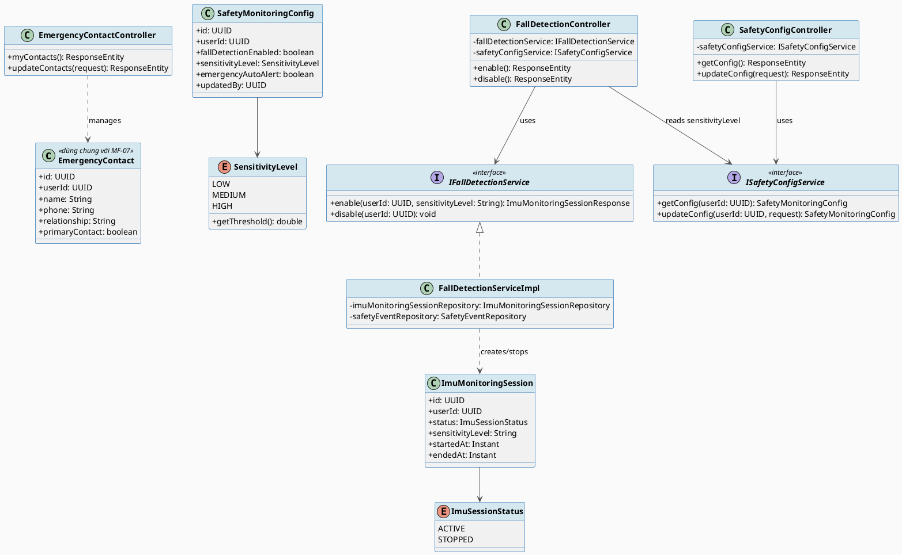
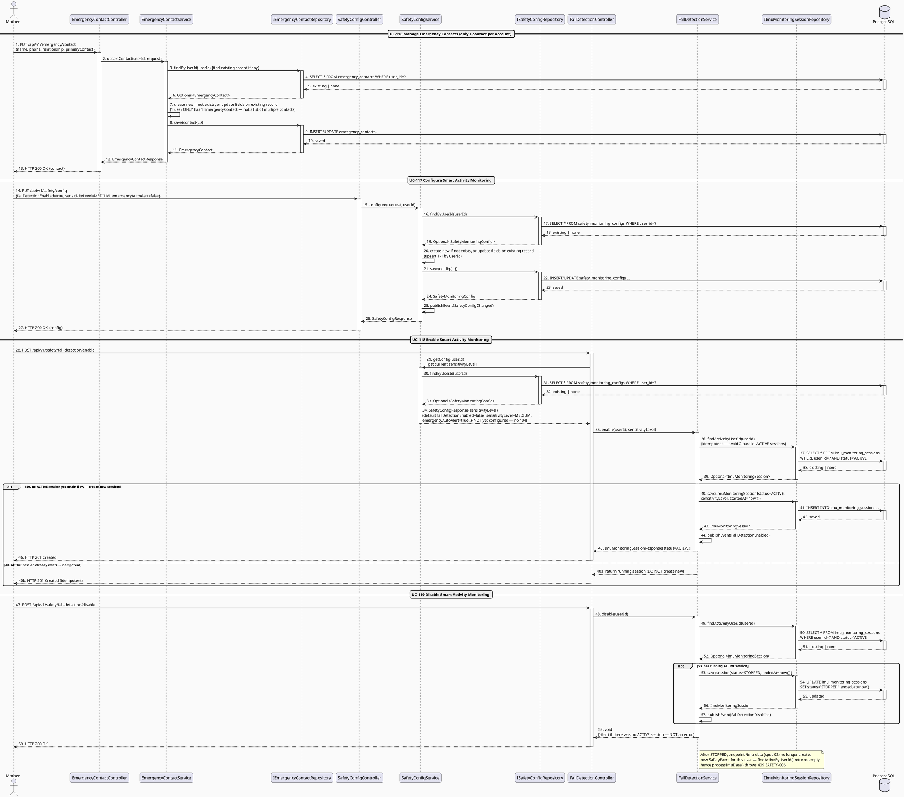
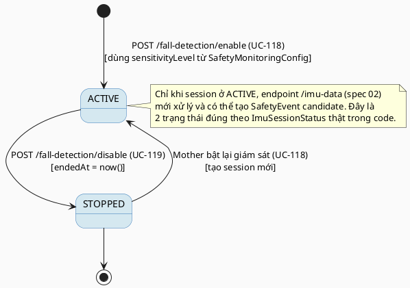

# MF-14 / Spec 01 — Smart Activity Monitoring: Configuration & Enable/Disable

| Field | Value |
| --- | --- |
| Feature | MF-14 — Smart Activity Monitoring & Safety Support |
| Use Cases Covered | UC-116 Manage Emergency Contacts, UC-117 Configure Smart Activity Monitoring, UC-118 Enable Smart Activity Monitoring, UC-119 Disable Smart Activity Monitoring |
| Primary Actor(s) | Mother |
| Platform | Mother Mobile App |
| Main Flow Summary | A Mother configures emergency contacts and monitoring sensitivity/consent, then starts an `ImuMonitoringSession` that runs until she explicitly stops it. This is the setup half of MF-14; the detection/response half (fall/impact handling) is spec 02. |
| Grounding (source code) | `emergency/entity/EmergencyContact.java` (dùng chung với MF-07), `safety/entity/SafetyMonitoringConfig.java`, `safety/SensitivityLevel.java`, `safety/entity/ImuMonitoringSession.java`, `safety/ImuSessionStatus.java`, `safety/controller/SafetyConfigController.java` (`/api/v1/safety/config`), `safety/controller/FallDetectionController.java` (`/api/v1/safety/fall-detection/enable|disable`) |

## 1. Tổng quan luồng chính (Main Flow Overview)

`EmergencyContact` (UC-116) dùng chung entity với MF-07 (chia sẻ vị trí khẩn cấp) —
đây là danh sách người nhận cảnh báo cho **cả hai** tính năng, không phải hai danh sách
tách biệt. `SafetyMonitoringConfig` (UC-117) là cấu hình 1-1 theo `userId`: bật/tắt phát
hiện ngã (`fallDetectionEnabled`), mức nhạy (`SensitivityLevel` → ngưỡng gia tốc cụ thể
qua `getThreshold()`), và `emergencyAutoAlert` (tự động gửi cảnh báo hay chờ xác nhận).
Bật giám sát (UC-118) tạo một `ImuMonitoringSession` mới ở trạng thái `ACTIVE`, dùng
`sensitivityLevel` hiện tại của config; tắt (UC-119) dừng session (`STOPPED`) và — theo
đúng mô tả UC-119 — **ngăn tạo candidate safety event mới** sau thời điểm đó.

## 2. Class Diagram

**Hình 1 — Class Diagram: Emergency Contact, Safety Monitoring Config & IMU Session**

## 3. Sequence Diagram — Main Flow

**Hình 2 — Sequence Diagram: Configure Contact/Sensitivity → Enable (idempotent) → Disable (silent no-op) Monitoring (Main Flow)**

> **Ghi chú grounding (quan trọng):**
> 1. `EmergencyContactService.upsertContact` chỉ quản lý **MỘT** `EmergencyContact` cho mỗi
>    user (tra cứu bằng `findByUserId`, 1-1) — request body là một object đơn
>    `{name, phone, relationship, primaryContact}`, **không phải mảng** `contacts: [...]`
>    như bản vẽ trước ngụ ý. UC-116 thực chất là "cấu hình một liên hệ khẩn cấp duy nhất",
>    không phải quản lý danh sách nhiều liên hệ.
> 2. Tên class thật là `SafetyConfigService` và `FallDetectionService` (không có hậu tố
>    `Impl` như class diagram mục 2 nêu). `getConfig()` trả về **giá trị mặc định hợp lý**
>    (`fallDetectionEnabled=false`, `sensitivityLevel=MEDIUM`, `emergencyAutoAlert=true`) khi
>    user chưa từng cấu hình — không ném lỗi 404.
> 3. `enable()` idempotent (trả lại session `ACTIVE` sẵn có thay vì tạo trùng);
>    `disable()` **im lặng no-op** nếu không có session `ACTIVE` nào đang chạy (không ném
>    lỗi) — khác với các "disable" khác trong hệ thống (ví dụ MF13) thường ném lỗi conflict
>    khi gọi lại trên trạng thái đã tắt.

## 4. State Machine — `ImuMonitoringSession.status`

**Hình 3 — State Machine: `ImuMonitoringSession.status` Lifecycle**

## 5. Business Rules Applied

- BR-RBAC / ownership — chỉ Mother (`hasRole('MOTHER')`) cấu hình và bật/tắt giám sát của chính mình.
- UC-116 — liên hệ khẩn cấp (1 bản ghi/user) dùng chung entity với MF-07 (gia đình) và MF-14 (an toàn cá nhân); `primaryContact` đánh dấu đây là điểm liên hệ chính.
- UC-117 — `sensitivityLevel` quyết định ngưỡng gia tốc thực tế (`getThreshold()`: LOW=15.0, MEDIUM=12.0, HIGH=9.0) dùng ở spec 02.
- UC-119 — tắt giám sát phải chặn ngay việc tạo candidate safety event mới, không chỉ ẩn UI.
- Excluded (SRS MF-14 description) — đây không phải thiết bị phát hiện ngã đã được chứng nhận y tế hay hệ thống điều phối cấp cứu.
