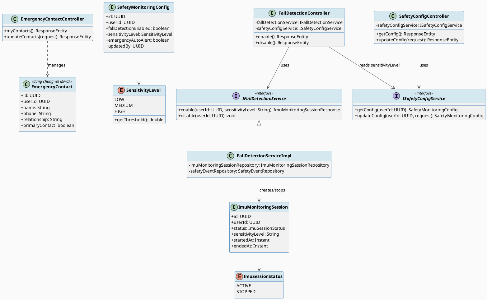
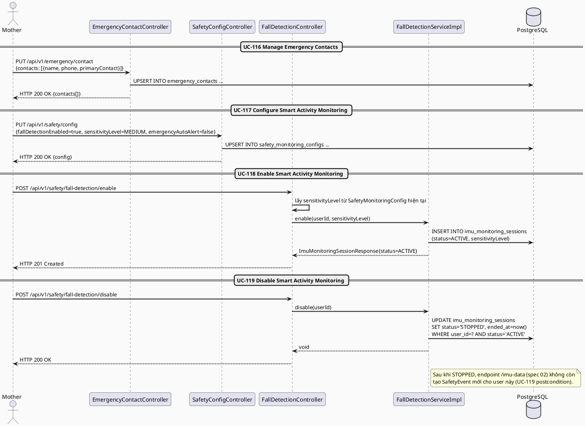
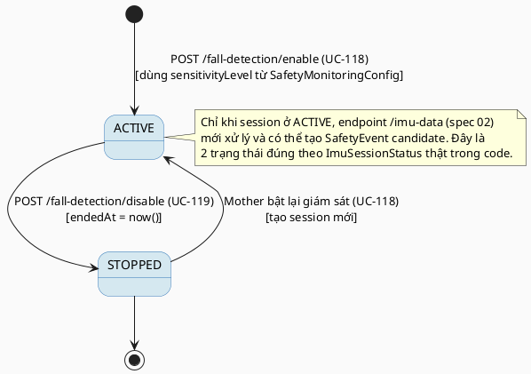

# MF-14 / Spec 01 — Smart Activity Monitoring: Configuration & Enable/Disable

| Field | Value |
| --- | --- |
| Feature | MF-14 — Smart Activity Monitoring & Safety Support |
| Use Cases Covered | UC-116 Manage Emergency Contacts, UC-117 Configure Smart Activity Monitoring, UC-118 Enable Smart Activity Monitoring, UC-119 Disable Smart Activity Monitoring |
| Primary Actor(s) | Mother |
| Platform | Mother Mobile App |
| Main Flow Summary | A Mother configures emergency contacts and monitoring sensitivity/consent, then starts an `ImuMonitoringSession` that runs until she explicitly stops it. This is the setup half of MF-14; the detection/response half (fall/impact handling) is spec 02. |
| Grounding (source code) | `emergency/entity/EmergencyContact.java` (dùng chung với MF-07), `safety/entity/SafetyMonitoringConfig.java`, `safety/SensitivityLevel.java`, `safety/entity/ImuMonitoringSession.java`, `safety/ImuSessionStatus.java`, `safety/controller/SafetyConfigController.java` (`/api/v1/safety/config`), `safety/controller/FallDetectionController.java` (`/api/v1/safety/fall-detection/enable|disable`) |

## 1. Tổng quan luồng chính (Main Flow Overview)

`EmergencyContact` (UC-116) dùng chung entity với MF-07 (chia sẻ vị trí khẩn cấp) —
đây là danh sách người nhận cảnh báo cho **cả hai** tính năng, không phải hai danh sách
tách biệt. `SafetyMonitoringConfig` (UC-117) là cấu hình 1-1 theo `userId`: bật/tắt phát
hiện ngã (`fallDetectionEnabled`), mức nhạy (`SensitivityLevel` → ngưỡng gia tốc cụ thể
qua `getThreshold()`), và `emergencyAutoAlert` (tự động gửi cảnh báo hay chờ xác nhận).
Bật giám sát (UC-118) tạo một `ImuMonitoringSession` mới ở trạng thái `ACTIVE`, dùng
`sensitivityLevel` hiện tại của config; tắt (UC-119) dừng session (`STOPPED`) và — theo
đúng mô tả UC-119 — **ngăn tạo candidate safety event mới** sau thời điểm đó.

## 2. Class Diagram

**Hình 1 — Class Diagram: Emergency Contact, Safety Monitoring Config & IMU Session**

## 3. Sequence Diagram — Main Flow

**Hình 2 — Sequence Diagram: Configure Contacts/Sensitivity → Enable → Disable Monitoring (Main Flow)**

## 4. State Machine — `ImuMonitoringSession.status`

**Hình 3 — State Machine: `ImuMonitoringSession.status` Lifecycle**

## 5. Business Rules Applied

- BR-RBAC / ownership — chỉ Mother (`hasRole('MOTHER')`) cấu hình và bật/tắt giám sát của chính mình.
- UC-116 — danh sách liên hệ khẩn cấp dùng chung cho cả MF-07 (gia đình) và MF-14 (an toàn cá nhân); phải xác thực trước khi dùng làm điểm liên hệ chính (`primaryContact`).
- UC-117 — `sensitivityLevel` quyết định ngưỡng gia tốc thực tế (`getThreshold()`: LOW=15.0, MEDIUM=12.0, HIGH=9.0) dùng ở spec 02.
- UC-119 — tắt giám sát phải chặn ngay việc tạo candidate safety event mới, không chỉ ẩn UI.
- Excluded (SRS MF-14 description) — đây không phải thiết bị phát hiện ngã đã được chứng nhận y tế hay hệ thống điều phối cấp cứu.
