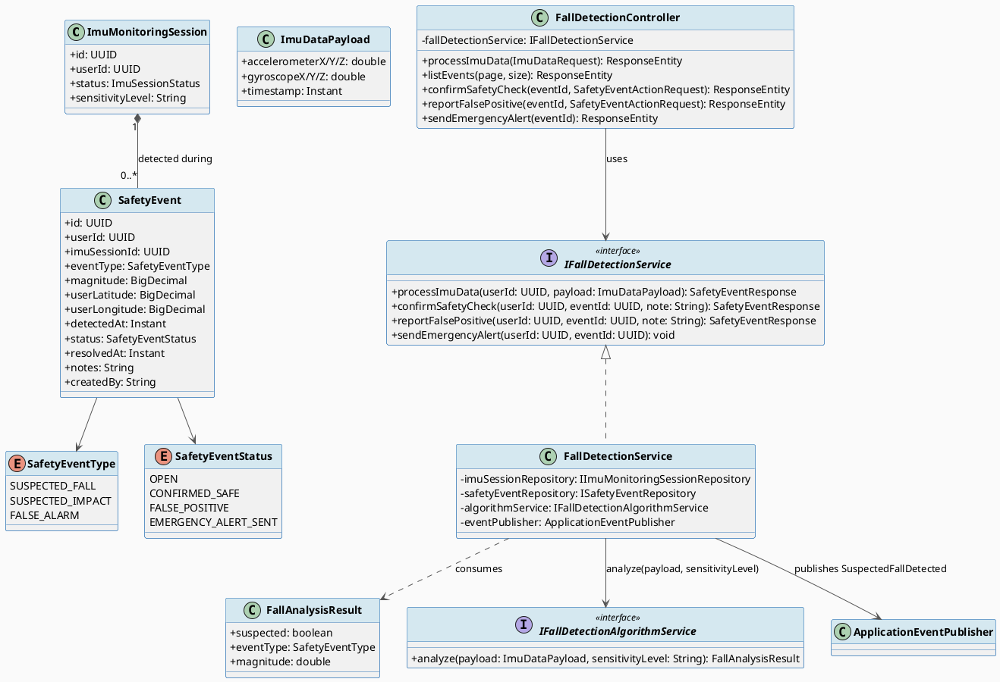
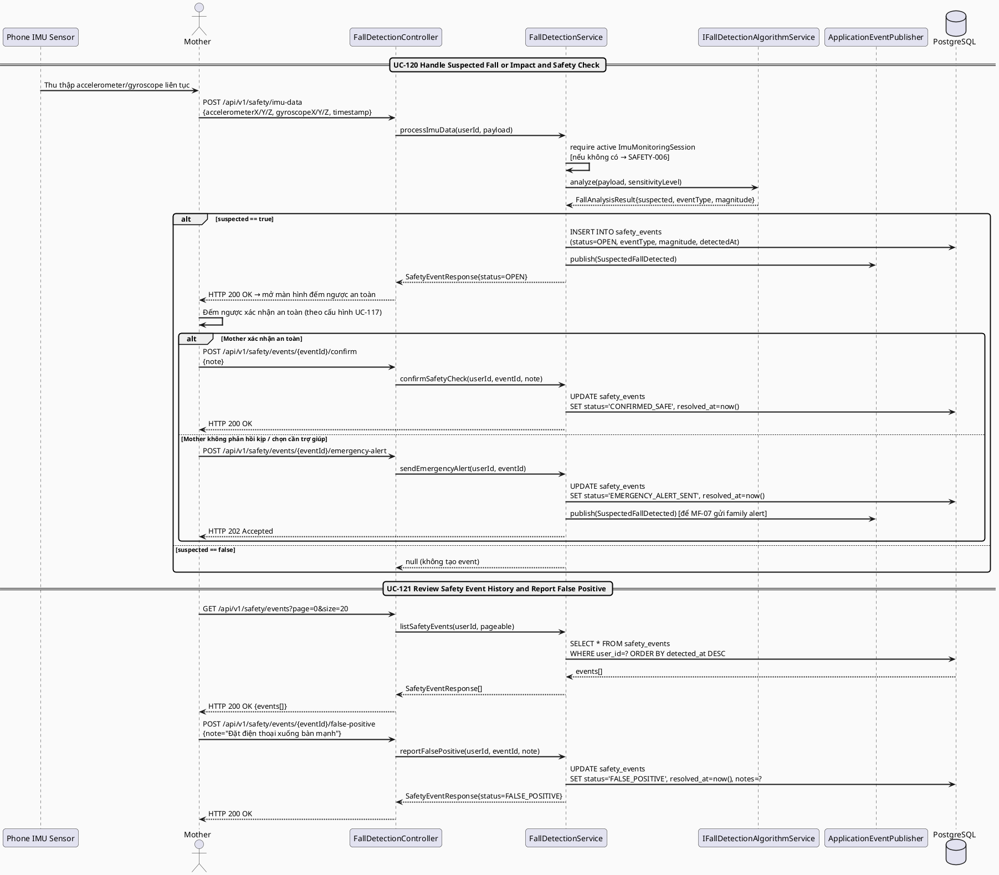
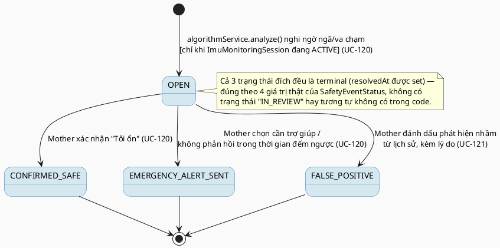

# MF-14 / Spec 02 — Suspected Fall/Impact Detection, Safety Check & False-Positive Feedback

| Field | Value |
| --- | --- |
| Feature | MF-14 — Smart Activity Monitoring & Safety Support |
| Use Cases Covered | UC-120 Handle Suspected Fall or Impact and Safety Check, UC-121 Review Safety Event History and Report False Positive Detection |
| Primary Actor(s) | Mother, Phone IMU Sensor (system) |
| Platform | Mother Mobile App |
| Main Flow Summary | The phone's IMU stream is analyzed against the active monitoring session's sensitivity threshold; a suspected fall/impact creates a candidate `SafetyEvent` and opens a safety confirmation on-device, which the Mother resolves as "I am OK" (confirmed safe), escalates to an emergency alert, or — afterwards, from history — marks as a false detection with a reason. |
| Grounding (source code) | `safety/entity/SafetyEvent.java`, `SafetyEventStatus.java`, `SafetyEventType.java`, `safety/service/impl/FallDetectionService.java` (`processImuData`, `confirmSafetyCheck`, `reportFalsePositive`, `sendEmergencyAlert`), `safety/controller/FallDetectionController.java` (`/api/v1/safety/imu-data`, `/events`, `/events/{id}/confirm`, `/events/{id}/false-positive`, `/events/{id}/emergency-alert`) |

## 1. Tổng quan luồng chính (Main Flow Overview)

`processImuData()` chỉ phân tích và tạo `SafetyEvent` khi có **session `ACTIVE`** (spec
01) — nếu không có, trả lỗi `SAFETY-006` thay vì âm thầm bỏ qua. Khi thuật toán
(`IFallDetectionAlgorithmService.analyze()`) nghi ngờ có ngã/va chạm dựa trên ngưỡng
`sensitivityLevel`, một `SafetyEvent` mới được tạo ở `status=OPEN` (mặc định) và phát sự
kiện `SuspectedFallDetected` — đây chính là lúc app mở màn hình đếm ngược xác nhận an toàn
(UC-120). Mother phản hồi một trong hai hướng: **xác nhận an toàn**
(`CONFIRMED_SAFE`) hoặc **gửi cảnh báo khẩn cấp** (`EMERGENCY_ALERT_SENT` — tái phát sự
kiện `SuspectedFallDetected` để các consumer khác, ví dụ MF-07 family alert, xử lý tiếp).
Sau đó, từ lịch sử sự kiện, Mother có thể đánh dấu một sự kiện là phát hiện nhầm
(`FALSE_POSITIVE`, kèm lý do — UC-121) để cải thiện đánh giá ngưỡng trong tương lai.

## 2. Class Diagram

**Hình 1 — Class Diagram: IMU Session, Safety Event & Fall Analysis**

## 3. Sequence Diagram — Main Flow

**Hình 2 — Sequence Diagram: IMU Data → Detect → Safety Check (Confirm/Alert) → History → False-Positive Feedback (Main Flow)**

## 4. State Machine — `SafetyEvent.status`

**Hình 3 — State Machine: `SafetyEvent.status` Lifecycle**

## 5. Business Rules Applied

- BR-SAFETY — chỉ session `ACTIVE` (spec 01) mới xử lý IMU data; tắt giám sát ngăn tạo `SafetyEvent` mới ngay lập tức (UC-119).
- UC-120 — đây không phải thiết bị y tế được chứng nhận; kết quả là "nghi ngờ" (`suspected`), không phải chẩn đoán chấn thương.
- UC-120 — `sendEmergencyAlert` phát lại sự kiện `SuspectedFallDetected` để các luồng khác (ví dụ family alert ở MF-07) có thể phản ứng — không tự dispatch cấp cứu.
- UC-121 — phản hồi phát hiện nhầm luôn yêu cầu lý do (`notes`), dùng để cải thiện đánh giá ngưỡng trong tương lai, không xoá lịch sử sự kiện gốc.
