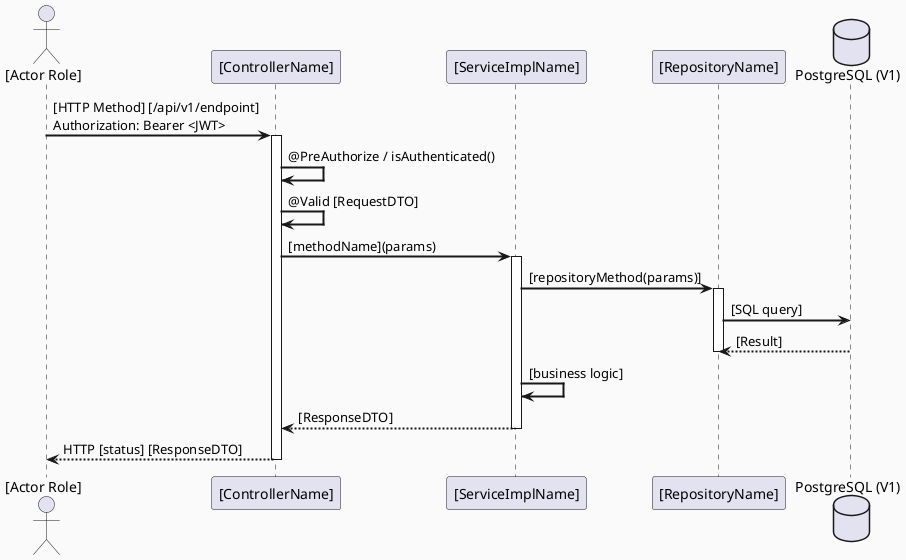

# CAREBRIDGE TECHNICAL DESIGN SPECIFICATION TEMPLATE
# Mẫu Đặc tả Thiết kế Kỹ thuật — CareBridge Stack

| Trường | Giá trị |
|--------|---------|
| **Document ID** | `CB-[DOMAIN]-PKG-[NN]-TDS` hoặc `CB-[DOMAIN]-IMP-[NNN]` (UC-level) |
| **Version** | `1.0` |
| **Date** | `YYYY-MM-DD` |
| **Status** | `DRAFT` |
| **Package** | `PKG-[NN] — [Package Name]` |
| **Included UCs** | `UC-XXX, UC-YYY, ...` |
| **Document Owner** | `[Tên cụ thể — không phải team]` |
| **Author** | `[Tên + Role]` |
| **Reviewed by** | `[ ] [Tech Lead]` |
| **Approved by** | `[ ] Pending` |
| **Last Review** | `YYYY-MM-DD` |
| **Based on** | `CareBridge TDS Template v1.0` |

> **Stack:** Spring Boot 3.5.x · JDK 21 · JPA/Hibernate · PostgreSQL · Flyway · JUnit 5 · Mockito · MockMvc · React + TypeScript · Flutter

---

## CHANGELOG

| Ngày | Người thực hiện | Nội dung thay đổi |
|------|-----------------|-------------------|
| YYYY-MM-DD | [Tên — Role] | Tạo tài liệu lần đầu |

---

## MỤC LỤC

1. [Tổng quan Module](#1-tổng-quan-module)
2. [Source-of-Truth Declaration](#2-source-of-truth-declaration)
3. [Ma trận Truy vết (Traceability Matrix)](#3-ma-trận-truy-vết-traceability-matrix)
4. [Architecture Decision Records (ADR)](#4-architecture-decision-records-adr)
5. [Non-Functional Requirements & SLA](#5-non-functional-requirements--sla)
6. [Static Modeling (Mô hình Tĩnh)](#6-static-modeling-mô-hình-tĩnh)
7. [Dynamic Modeling (Mô hình Động)](#7-dynamic-modeling-mô-hình-động)
8. [Domain Event Catalog](#8-domain-event-catalog)
9. [Interface Specification (Đặc tả Giao diện)](#9-interface-specification-đặc-tả-giao-diện)
10. [API Specification](#10-api-specification)
11. [Bảng mã lỗi (Error Codes)](#11-bảng-mã-lỗi-error-codes)
12. [Schema Mapping (V1 Verification)](#12-schema-mapping-v1-verification)
13. [Schema Gap Section](#13-schema-gap-section)
14. [Quy trình Triển khai (Implementation Order)](#14-quy-trình-triển-khai-implementation-order)
15. [Rollback & Incident Runbook](#15-rollback--incident-runbook)
16. [Kịch bản Kiểm thử Chi tiết](#16-kịch-bản-kiểm-thử-chi-tiết)
17. [Verification Checklist](#17-verification-checklist)
18. [Bảng tổng hợp phân quyền (Authorization Matrix)](#18-bảng-tổng-hợp-phân-quyền-authorization-matrix)
19. [As-Built Reconciliation](#19-as-built-reconciliation)
20. [AI Prompt Constraints (CASE 2.0)](#20-ai-prompt-constraints-case-20)

---

## 1. Tổng quan Module

| Trường | Giá trị |
|--------|---------|
| **Module Name** | `[Tên package/module]` |
| **Bounded Context** | `[community / security / content / partner / audit / integration / maternal / care / consultation / payment / location / safety / triage / consent / notification / exercise / health / expert]` |
| **UC IDs** | `UC-XXX, UC-YYY` |
| **SRS Reference** | `3.x.x.x` |
| **Primary Actor(s)** | `[Role — ví dụ: MOTHER, MODERATOR]` |
| **Platform** | `[Backend API / Admin Web Portal (React) / Mobile App (Flutter) / All]` |
| **Data Classification** | `Public / Internal / Confidential` |
| **Upstream Dependencies** | `[PKG-XX, PKG-YY]` |
| **Downstream Consumers** | `[PKG-XX (reads from this package's tables)]` |
| **External Integrations** | `[None / Gemini / Firebase / ZegoCloud / VNPay / TrackAsia / v.v.]` |

**Mô tả:** [Mô tả ngắn gọn mục đích của module/package, phạm vi nghiệp vụ và lý do tồn tại. Không quá 5 dòng.]

---

## 2. Source-of-Truth Declaration

> Điền trước khi viết bất kỳ section nào khác. Xác nhận nguồn sự thật cho package này.

| Item | Source | Verified? | Notes |
|------|--------|-----------|-------|
| Table definitions | `V1__init_schema.sql` lines [XXX–YYY] | `[ ]` | — |
| Role names | `05_Development/Contracts/rbac-role-mapping.md` | `[ ]` | Dùng đúng: `MOTHER`, `MODERATOR`, v.v. |
| As-built APIs | `[ControllerClassName.java]` | `[ ]` | N/A nếu NOT_IMPLEMENTED |
| Business rules | `SRS §3.x.x.x UC-XXX` | `[ ]` | — |
| Schema Gap refs | `docs/schema-gaps/SCHEMA_GAP_REGISTER.md` | `[ ]` | List GAP-IDs nếu có |

---

## 3. Ma trận Truy vết (Traceability Matrix)

> Ánh xạ trực tiếp: [Mã yêu cầu] → [Thành phần Code] → [Mục tiêu Tuân thủ].
> **Policy:** Không viết code nếu không biết code đó phục vụ Rule nào.

| Requirement ID | Loại | Mô tả yêu cầu | Thành phần Code | Compliance Target | ADR liên quan |
|----------------|------|---------------|-----------------|-------------------|---------------|
| UC-XXX | Use Case | [Mô tả] | `[ControllerName]` | BR-RBAC | ADR-[NNN] |
| BR-RBAC | Business Rule | Only [ROLE] can [action] | `@PreAuthorize("hasRole('[ROLE]')")` | RBAC | — |
| BR-[DOMAIN]-001 | Business Rule | [Mô tả business rule] | `[ServiceImpl.method()]` | Data integrity | — |

---

## 4. Architecture Decision Records (ADR)

### ADR-[DOMAIN]-[NNN] — [Tiêu đề quyết định]

| Trường | Giá trị |
|--------|---------|
| **Status** | `Accepted` |
| **Date** | `YYYY-MM-DD` |

#### Bối cảnh (Context)
[Mô tả vấn đề cần quyết định]

#### Quyết định (Decision)
[Giải pháp đã chọn và lý do]

#### Hệ quả (Consequences)
**Tích cực:** [...]
**Trade-offs:** [...]

> *(Thêm ADR mới bên dưới. Không xóa ADR cũ — đánh dấu `Superseded` nếu bị thay thế.)*

---

## 5. Non-Functional Requirements & SLA

### 5.1. Performance

| Category | Requirement | Target SLA |
|----------|-------------|------------|
| Latency | API response (p99) | `< 300ms` (adjust per feature) |
| Throughput | Peak concurrent | MVP: ~50 users |

### 5.2. Security

| Category | Requirement | Verification |
|----------|-------------|--------------|
| Authorization | [ROLE]-only for write ops | `@PreAuthorize` + security test |
| Input validation | Bean Validation (`@Valid`) | Controller test |
| Audit | Sensitive actions logged | `AuditService` emit |

---

## 6. Static Modeling (Mô hình Tĩnh)

### 6.1. Class Diagram (PlantUML)

```plantuml
@startuml [PackageName]_ClassDiagram
skinparam classAttributeIconSize 0
skinparam classFontStyle bold
skinparam backgroundColor #FAFAFA
skinparam ClassBorderColor #2E75B6
skinparam ClassHeaderBackgroundColor #D5E8F0

' === ENTITY (ánh xạ từ V1 table — xem §12 cho V1 verification) ===
class [EntityName] {
  + id: UUID
  + [field]: [JavaType]   ' maps to [column_name] [sql_type]
  + createdAt: LocalDateTime
  + updatedAt: LocalDateTime
}

' === DTOs ===
class [CreateRequest] {
  + [field]: [JavaType]
}

class [ResponseDTO] {
  + id: UUID
  + [field]: [JavaType]
}

' === SERVICE INTERFACE ===
interface [ServiceName] <<interface>> {
  + [methodName](params): ReturnType
}

class [ServiceImplName] implements [ServiceName] {
  - repository: [RepositoryName]
  - mapper: [MapperName]
  - auditService: AuditService
  + [methodName](params): ReturnType
}

' === REPOSITORY (extends JpaRepository) ===
interface [RepositoryName] <<JpaRepository>> {
  + findBy[Field](value): List<[Entity]>
}

' === CONTROLLER ===
class [ControllerName] {
  - service: [ServiceName]
  + [handlerMethod](params): ResponseEntity<ApiResponse<T>>
}

' === MAPPER ===
class [MapperName] {
  + toEntity(request, [contextParams]): [Entity]
  + toResponse(entity): [ResponseDTO]
}

[ControllerName] --> [ServiceName] : uses
[ServiceImplName] --> [RepositoryName] : uses
[ServiceImplName] --> [MapperName] : uses

@enduml
```

### 6.2. JPA Entity (Java — khớp với V1 schema)

```java
package com.carebridge.backend.[domain].entity;

import jakarta.persistence.*;
import lombok.*;
import org.hibernate.annotations.CreationTimestamp;
import org.hibernate.annotations.UpdateTimestamp;
import java.time.LocalDateTime;
import java.util.UUID;

@Entity
@Table(name = "[v1_table_name]")
@Getter @Setter @NoArgsConstructor @AllArgsConstructor @Builder
public class [EntityName] {

    @Id
    @GeneratedValue(strategy = GenerationType.UUID)
    @Column(name = "id", updatable = false, nullable = false)
    private UUID id;

    // [Thêm columns từ V1 table — xem §12 Schema Mapping]
    // @Column(name = "[v1_column_name]", nullable = [true/false], length = [n])
    // private [JavaType] [fieldName];

    @CreationTimestamp
    @Column(name = "created_at", updatable = false)
    private LocalDateTime createdAt;

    @UpdateTimestamp
    @Column(name = "updated_at")
    private LocalDateTime updatedAt;
}
```

> **V1 Verification:** Xem §12 để biết mapping chi tiết entity field → V1 column.

---

## 7. Dynamic Modeling (Mô hình Động)

### 7.1. Sequence Diagram — [Happy Path Use Case] (PlantUML)



### 7.2. State Machine (nếu có trạng thái phức tạp)

```plantuml
@startuml [PackageName]_StateMachine_[EntityName]
skinparam backgroundColor #FAFAFA

[*] --> [InitialState] : [trigger]
[InitialState] --> [NextState] : [condition / action]
[NextState] --> [FinalState] : [condition / action]

@enduml
```

---

## 8. Domain Event Catalog

| Event Name | Trigger | Publisher | Subscriber(s) | Async? |
|------------|---------|-----------|---------------|--------|
| `[EntityAction]Event` | [When triggered] | `[ServiceImplName]` | `AuditService` | No |

### 8.1. Payload Schema (Java record)

```java
public record [EventName](
    String eventId, String eventType, String occurredAt, String version,
    Payload payload
) {
    public record Payload([fields]) {}
}
```

---

## 9. Interface Specification (Đặc tả Giao diện)

### 9.1. Service Interface

```java
package com.carebridge.backend.[domain].service;

public interface [ServiceName] {

    /**
     * [Mô tả method]
     * @throws [ExceptionClassName] ([ERROR-CODE]) when [condition]
     */
    [ReturnType] [methodName]([params]);
}
```

### 9.2. Repository Interface

```java
package com.carebridge.backend.[domain].repository;

import org.springframework.data.jpa.repository.JpaRepository;
import java.util.UUID;

public interface [RepositoryName] extends JpaRepository<[Entity], UUID> {

    // Tên method phải match Spring Data JPA naming convention
    // Dẫn xuất từ V1 column names (xem §12)
    List<[Entity]> findBy[Field]([FieldType] value);
    boolean existsBy[Field]([FieldType] value);
}
```

### 9.3. Request/Response DTOs

```java
// Request DTO — validate tại Controller layer
@Data
public class [Create/Update]Request {
    @NotBlank @Size(max = [N]) private String [fieldName];
    // [Thêm fields với validation annotations]
}

// Response DTO — không expose JPA entity trực tiếp
@Data @Builder
public class [Name]Response {
    private UUID id;
    private String [fieldName];
    private LocalDateTime createdAt;
}
```

---

## 10. API Specification

### 10.1. Endpoints Table

| Method | Path | Auth Level | Required Roles | Rate Limit | Idempotent? |
|--------|------|-----------|----------------|------------|-------------|
| `[METHOD]` | `/api/v1/[path]` | JWT Bearer | `[ROLE_NAME từ rbac-role-mapping.md]` | [N]/min | Yes/No |

> **Role names:** Dùng đúng values từ `05_Development/Contracts/rbac-role-mapping.md §1`.
> Các giá trị hợp lệ: `MOTHER`, `FAMILY`, `EXPERT`, `MODERATOR`, `CONTENT_ADMIN`, `SYSTEM_ADMIN`, `PARTNER`.

### 10.2. Request / Response Schemas

#### `[METHOD] /api/v1/[path]`

**Request Body:**
```json
{
  "[fieldName]": "[value]",
  "[fieldName2]": [value2]
}
```

**Response — [HTTP_STATUS]:**
```json
{
  "success": true,
  "data": {
    "id": "uuid-here",
    "[fieldName]": "[value]"
  },
  "message": "[optional message]"
}
```

**Error Response:**
```json
{
  "success": false,
  "error": {
    "code": "[ERROR-CODE]",
    "message": "[human-readable message]"
  }
}
```

---

## 11. Bảng mã lỗi (Error Codes)

| Code | HTTP Status | Message (EN) | Message (VI) | Trigger Condition |
|------|-------------|--------------|--------------|-------------------|
| `[DOMAIN]-001` | 400 | Validation failed | Dữ liệu không hợp lệ | [Field validation failure] |
| `[DOMAIN]-003` | 404 | Resource not found | Không tìm thấy | [ID không tồn tại] |
| `[DOMAIN]-004` | 403 | Insufficient permissions | Không đủ quyền | [Wrong role] |
| `[DOMAIN]-005` | 500 | Internal server error | Lỗi hệ thống | DB error |

> Tất cả error codes phải được đăng ký trong `GlobalExceptionHandler.java`.

---

## 12. Schema Mapping (V1 Verification)

> **Bắt buộc:** Verify từng field của JPA entity so với V1 column. Không được assume — phải check `V1__init_schema.sql`.

| Entity Field | Java Type | V1 Column Name | V1 SQL Type | V1 Nullable | V1 Default | Match? | Notes |
|-------------|-----------|----------------|-------------|-------------|-----------|--------|-------|
| `id` | `UUID` | `id` | `uuid` | NOT NULL | — (app-generated) | `[ ]` | PK |
| `[fieldName]` | `[Type]` | `[column_name]` | `[sql_type]` | [NULL/NOT NULL] | [value/none] | `[ ]` | [note] |
| `createdAt` | `LocalDateTime` | `created_at` | `timestamp with time zone` | NOT NULL | — (or `now()`) | `[ ]` | @CreationTimestamp |
| `updatedAt` | `LocalDateTime` | `updated_at` | `timestamp with time zone` | NULL | `now()` | `[ ]` | @UpdateTimestamp |

**Foreign Key verification:**

| Entity Field | FK Target Table | V1 FK Constraint | Match? |
|-------------|----------------|------------------|--------|
| `[fieldName]` | `[target_table].id` | [constraint name or "NONE"] | `[ ]` |

> **Nếu V1 không có FK nhưng code dùng:** Ghi note "Referential integrity enforced at application layer".

---

## 13. Schema Gap Section

> Liệt kê mọi mâu thuẫn giữa business requirement / TDS và V1 schema thực tế.
> **Không tự giải quyết gap.** Tạo entry trong `docs/schema-gaps/SCHEMA_GAP_REGISTER.md`.

| GAP-ID | Column / Constraint | TDS Claim | V1 Reality | Impact | Resolution |
|--------|--------------------|-----------|-----------|----|------------|
| `GAP-[NN]` | `[table].[column]` | [what TDS says] | [what V1 has] | BLOCKING / NON_BLOCKING | See `SCHEMA_GAP_REGISTER.md GAP-[NN]` |

*Nếu không có gap: "Không phát hiện Schema Gap — V1 schema đủ cho package này."*

---

## 14. Quy trình Triển khai (Implementation Order)

### 14.1. Prerequisites

- [ ] Package Dependencies đã AS_BUILT: `[PKG-XX, PKG-YY]`
- [ ] V1 tables đã verified (§12)
- [ ] Schema Gaps resolved hoặc NON_BLOCKING (§13)
- [ ] Gate checklist passed (§17)

### 14.2. Implementation Steps

> **QUAN TRỌNG:** Kiểm tra V1 trước khi tạo migration.
> Nếu table đã tồn tại trong V1: **KHÔNG tạo migration**. Chỉ tạo migration cho table/column MỚI chưa có trong V1.

#### Bước 1 — Kiểm tra V1 schema

```bash
# Tìm table trong V1
grep -n "[table_name]" 05_Development/CareBridgeAPI/src/main/resources/db/migration/V1__init_schema.sql
```

#### Bước 2 — V2+ Migration (chỉ khi cần — sau Human Decision)

```sql
-- Chỉ khi có approved Schema Gap yêu cầu thay đổi schema
-- V[N]__[short_description].sql
-- GAP-ID: [GAP-NN]
-- Human Decision: HD-[NN] (APPROVED by [Tech Lead] on YYYY-MM-DD)

-- [SQL thay đổi schema — ALTER TABLE, không DROP TABLE]
```

#### Bước 3 — Backend Implementation Order

```
1. entity/[EntityName].java
2. repository/[RepositoryName].java
3. dto/request/[CreateRequest].java
4. dto/request/[UpdateRequest].java (nếu cần)
5. dto/response/[ResponseDTO].java
6. mapper/[MapperName].java
7. service/[ServiceName].java (interface)
8. service/[ServiceImplName].java
9. controller/[ControllerName].java
10. exception/[ExceptionName].java (nếu cần)
```

#### Bước 4 — Web Implementation (nếu áp dụng)

```
src/features/[featureName]/
├── pages/[FeaturePage].tsx
├── services/[featureApi].ts
├── components/[FeatureComponent].tsx
└── models/[featureModel].ts
```

#### Bước 5 — Flutter Implementation (nếu áp dụng)

```
lib/features/[featureName]/
├── screens/[feature_screen].dart
└── services/[feature_service].dart
```

### 14.3. Verification sau deploy

```bash
# Kiểm tra bằng curl hoặc IDE REST client
# Xem §10.2 cho request/response samples cụ thể

# GET (any authenticated)
curl -X GET "http://localhost:8080/api/v1/[path]" \
  -H "Authorization: Bearer [VALID_JWT]"

# POST (role-specific)
curl -X POST "http://localhost:8080/api/v1/[path]" \
  -H "Authorization: Bearer [ROLE_JWT]" \
  -H "Content-Type: application/json" \
  -d '[see §10.2 request body]'
```

---

## 15. Rollback & Incident Runbook

### 15.1. Điều kiện kích hoạt Rollback

| Điều kiện | Ngưỡng | Người quyết định |
|-----------|--------|------------------|
| [Error condition] | [Threshold] | On-call Engineer / Tech Lead |

### 15.2. Rollback Procedure

> **QUAN TRỌNG:** Không DROP TABLE domain tables. Chỉ rollback application.

```bash
# Rollback application deployment
# (Specific to your CI/CD setup — GitLab CI pipeline revert)

# Nếu có V2+ migration cần rollback:
# Tham khảo GAP-[NN] và xem xét DOWN migration
# Phải approved bởi Tech Lead trước khi chạy
```

---

## 16. Kịch bản Kiểm thử Chi tiết

> Mô tả các test scenarios theo Gherkin pseudocode. Implementation là JUnit 5 trong `.java` files (xem Test-Spec).

### 16.1. Happy Path

```gherkin
Scenario: [Tên test case chính]
  Given [precondition]
  When [action]
  Then [expected result]
  And [side effect]
```

### 16.2. Validation Failures

```gherkin
Scenario: [Invalid input]
  Given [invalid precondition]
  When [action with invalid data]
  Then response status = [4xx]
  And error.code = "[DOMAIN]-001"
```

### 16.3. Authorization Tests

```gherkin
Scenario: Wrong role cannot access write endpoint
  Given JWT với ROLE_[WRONG_ROLE]
  When [POST/PATCH/DELETE] /api/v1/[path]
  Then response status = 403
  And error.code = "[DOMAIN]-004"

Scenario: Unauthenticated request rejected
  When [endpoint] without JWT
  Then response status = 401
```

---

## 17. Verification Checklist

> Tích vào khi đã verified. Chỉ check nếu thực sự đã verify — không pre-check.

### Gate Checklist (trước implementation)

```
[ ] §2 Source-of-Truth Declaration điền đầy đủ
[ ] §12 Schema Mapping verified với V1 schema
[ ] §13 Schema Gaps documented (nếu có)
[ ] §10 API Contract explicit (method, path, request, response, error codes)
[ ] §18 Authorization Matrix dùng đúng role names từ rbac-role-mapping.md
[ ] §20 AI Constraint Block có mặt và đủ
[ ] Package Dependencies đã AS_BUILT
[ ] Không có blocking Human Decision OPEN
```

### Exit Criteria (sau implementation)

```
[ ] Tất cả unit tests pass (./mvnw test -Dtest=[ServiceImplTest])
[ ] Tất cả controller tests pass (./mvnw test -Dtest=[ControllerTest])
[ ] Authorization tests pass (401/403 cases)
[ ] Audit log emit verified
[ ] §19 As-Built Reconciliation điền đầy đủ
[ ] Schema Gap register updated nếu phát hiện gap mới
```

---

## 18. Bảng tổng hợp phân quyền (Authorization Matrix)

> Dùng đúng role names từ `05_Development/Contracts/rbac-role-mapping.md §1`.

| Endpoint | `UNAUTHENTICATED` | `MOTHER` | `FAMILY` | `EXPERT` | `MODERATOR` | `CONTENT_ADMIN` | `SYSTEM_ADMIN` | `PARTNER` |
|----------|:-----------------:|:--------:|:--------:|:--------:|:-----------:|:---------------:|:--------------:|:---------:|
| `[METHOD] /api/v1/[path]` | ❌ (401) | [✅/❌] | [✅/❌] | [✅/❌] | [✅/❌] | [✅/❌] | [✅/❌] | [✅/❌] |

---

## 19. As-Built Reconciliation

> Section này được điền SAU KHI implementation hoàn thành và tests pass.
> **Bắt buộc điền trước khi PR merge.**

| Item | TDS Claim | As-Built Reality | Diff? | Action Taken |
|------|-----------|-----------------|-------|--------------|
| [API path] | [TDS spec] | [Actual implementation] | [MATCH/DIFF] | [note] |
| [Entity field] | [TDS spec] | [Actual field] | [MATCH/DIFF] | [note] |
| [Role enforcement] | [TDS spec] | [Actual @PreAuthorize] | [MATCH/DIFF] | [note] |

**Tổng kết:** `[N] MATCH, [N] DIFF (tất cả đã được documented)`

---

## 20. AI Prompt Constraints (CASE 2.0)

### 20.1 Constraint Summary Table

| # | Constraint | Source | Last Verified |
|---|-----------|--------|---------------|
| C1 | [Role enforcement rule] | `ADR-[NNN], BR-RBAC` | `YYYY-MM-DD` |
| C2 | [Data ownership rule] | `ADR-[NNN]` | `YYYY-MM-DD` |
| C3 | [Soft/Hard delete rule] | `ADR-[NNN]` | `YYYY-MM-DD` |
| C4 | [Schema constraint] | `V1__init_schema.sql` | `YYYY-MM-DD` |
| C5 | [Uniqueness rule] | `BR-[DOMAIN]-[NNN]` | `YYYY-MM-DD` |

### 20.2 Constraint Injection Block

```
[CONSTRAINT BLOCK — Package: PKG-[NN] — [PackageName]]
Theo TDS CB-[DOMAIN]-PKG-[NN]-TDS:

1. Role enforcement:
   - [METHOD] /api/v1/[path]: PHẢI @PreAuthorize("hasRole('[ROLE]')")
   - [METHOD] /api/v1/[path]: isAuthenticated() đủ

2. Owner extraction:
   - [Field] PHẢI lấy từ SecurityUtils.requireCurrentUserId(principal)
   - KHÔNG lấy từ request body

3. Delete policy:
   - [Entity] dùng [soft/hard] delete: [column=value / DELETE FROM]

4. Uniqueness:
   - [Field] unique via [repository method]: [existsBy...]

5. Audit:
   - PHẢI emit [EventName] event sau [action]

6. Schema constraints:
   - [Constraint note từ V1]
   - [FK note nếu có]

7. Forbidden:
   - KHÔNG [specific anti-pattern]
```

### 20.3 Anti-Pattern Detection

| AP-ID | Anti-Pattern | Dấu hiệu | Hành động |
|-------|-------------|----------|----------|
| AP-AI-001 | Wrong role | `isAuthenticated()` thay vì `hasRole()` cho write ops | Reject — C1 |
| AP-AI-002 | Request body owner | `request.getUserId()` thay vì `SecurityUtils.requireCurrentUserId()` | Reject — C2 |
| AP-AI-003 | Hallucinated endpoint | Endpoint không có trong §10 | Reject |
| AP-AI-004 | Entity in response | `return ResponseEntity.ok(entity)` thay vì DTO | Reject |
| AP-AI-005 | Wrong delete | Hard delete khi TDS nói soft delete | Reject — C3 |

---

*CareBridge TDS Template v1.0 — Adapted for Spring Boot 3.5.x / JDK 21 / JPA / PostgreSQL*
